
26.2 · PLAYER FIELD GUIDE

# 26.2 RPG Series by Valhaimerd

A practical player guide to the RPG systems, exploration, survival loops, and tools that reshape this pack.

<strong>Author:</strong> Valhaimerd <strong>Pack:</strong> Minecraft 26.2 · NeoForge 26.2 <strong>Edition:</strong> October 2026 <strong>Distribution:</strong> 282 synchronized JARs · 4 optional client extras

Last audited: 2026-10-10 
Pack target: Minecraft 26.2 with NeoForge 26.2 
Current distribution: 282 synchronized JARs plus 4 optional client-store JARs

## About this handbook

This handbook is written for players who understand vanilla Minecraft but are new to this modpack. It prioritizes changed mechanics, controls, configuration, and relationships between systems rather than exhaustive lists of items, creatures, blocks, recipes, structures, or loot.

Libraries, APIs, compatibility bridges, and invisible server internals are omitted from the gameplay catalog. A support mod may still appear in the keybind reference when it exposes controls to players.

## How entries are organized

Each mod has one primary entry. Secondary topics link back to that entry instead of repeating it. Broad mods use an Integrated expansion type when they combine multiple substantial systems.

**Entry types:** Core system; Integrated expansion; Focused content; Utility; Interface feature; Optional client feature.

**Integrated-expansion subtypes:** Integrated world expansion; Integrated dimension expansion; Integrated adventure expansion; Integrated character-progression suite; Integrated survival or profession expansion; Integrated building expansion.

**Cross-reference tags:** Combat; Character; Skills; Magic; Equipment; Bosses; Events; World Generation; Structures; Creatures; Companions; Farming; Food; Building; Storage; Travel; Multiplayer; Controls; HUD.

## Table of Contents

<table class="toc-table">
  <tbody>
    <tr><td><a href="#alphabetical-mod-index">Alphabetical mod index</a></td><td>3</td></tr>
    <tr><td><a href="#gameplay-tag-index">Gameplay-tag index</a></td><td>4</td></tr>
    <tr><td><a href="#quick-reference">Quick Reference</a></td><td>5</td></tr>
    <tr class="toc-part"><td><a href="#part-i--start-here">Part I — Start Here</a></td><td>6</td></tr>
    <tr class="toc-subsection"><td><a href="#essential-keybinds-and-conflict-resolution">Essential keybinds and conflict resolution</a></td><td>6</td></tr>
    <tr class="toc-subsection"><td><a href="#choosing-a-race">Choosing a race</a></td><td>11</td></tr>
    <tr class="toc-subsection"><td><a href="#choosing-a-class">Choosing a class</a></td><td>12</td></tr>
    <tr class="toc-subsection"><td><a href="#skills-abilities-spells-and-runes">Skills, abilities, spells, and runes</a></td><td>13</td></tr>
    <tr class="toc-subsection"><td><a href="#first-session-checklist">First-session checklist</a></td><td>15</td></tr>
    <tr class="toc-subsection"><td><a href="#parties-downed-players-and-death">Parties, downed players, and death</a></td><td>16</td></tr>
    <tr class="toc-part"><td><a href="#part-ii--character-and-core-systems">Part II — Character and Core Systems</a></td><td>19</td></tr>
    <tr class="toc-subsection"><td><a href="#races-and-racial-traits">Races and racial traits</a></td><td>19</td></tr>
    <tr class="toc-subsection"><td><a href="#classes-and-playstyles">Classes and playstyles</a></td><td>19</td></tr>
    <tr class="toc-subsection"><td><a href="#skill-trees-and-character-progression">Skill trees and character progression</a></td><td>20</td></tr>
    <tr class="toc-subsection"><td><a href="#abilities-spells-runes-and-resources">Abilities, spells, runes, and resources</a></td><td>20</td></tr>
    <tr class="toc-subsection"><td><a href="#combat-controls-and-dodge-rolling">Combat controls and dodge rolling</a></td><td>21</td></tr>
    <tr class="toc-subsection"><td><a href="#weapons-armor-jewelry-and-relics">Weapons, armor, jewelry, and relics</a></td><td>21</td></tr>
    <tr class="toc-subsection"><td><a href="#enchanting-and-equipment-improvement">Enchanting and equipment improvement</a></td><td>25</td></tr>
    <tr class="toc-subsection"><td><a href="#death-revival-graves-and-respawning">Death, revival, graves, and respawning</a></td><td>27</td></tr>
    <tr class="toc-subsection"><td><a href="#parties-and-multiplayer-cooperation">Parties and multiplayer cooperation</a></td><td>27</td></tr>
    <tr class="toc-part"><td><a href="#part-iii--adventure-and-challenge">Part III — Adventure and Challenge</a></td><td>28</td></tr>
    <tr class="toc-subsection"><td><a href="#bosses-and-major-encounters">Bosses and major encounters</a></td><td>28</td></tr>
    <tr class="toc-subsection"><td><a href="#invasions-and-wave-events">Invasions and wave events</a></td><td>29</td></tr>
    <tr class="toc-subsection"><td><a href="#dangerous-nights-and-environmental-threats">Dangerous nights and environmental threats</a></td><td>29</td></tr>
    <tr class="toc-subsection"><td><a href="#travel-maps-compasses-and-teleportation">Travel, maps, compasses, and teleportation</a></td><td>30</td></tr>
    <tr class="toc-subsection"><td><a href="#integrated-world-and-dimension-expansions">World and dimension expansions</a></td><td>32</td></tr>
    <tr class="toc-subsection"><td><a href="#structures-and-dungeons">Structures and dungeons</a></td><td>33</td></tr>
    <tr class="toc-subsection"><td><a href="#creatures-and-hostile-mobs">Creatures and hostile mobs</a></td><td>36</td></tr>
    <tr class="toc-subsection"><td><a href="#companions-pets-villagers-and-settlements">Companions, pets, villagers, and settlements</a></td><td>40</td></tr>
    <tr class="toc-part"><td><a href="#part-iv--survival-and-creation">Part IV — Survival and Creation</a></td><td>42</td></tr>
    <tr class="toc-subsection"><td><a href="#resource-gathering-and-repetitive-actions">Resource gathering and repetitive actions</a></td><td>42</td></tr>
    <tr class="toc-subsection"><td><a href="#farming-food-and-cooking">Farming, food, and cooking</a></td><td>42</td></tr>
    <tr class="toc-subsection"><td><a href="#fishing-and-collection-systems">Fishing and collection systems</a></td><td>43</td></tr>
    <tr class="toc-subsection"><td><a href="#potions-and-alchemy">Potions and alchemy</a></td><td>44</td></tr>
    <tr class="toc-subsection"><td><a href="#building-and-decoration">Building and decoration</a></td><td>44</td></tr>
    <tr class="toc-subsection"><td><a href="#storage-and-inventory-management">Storage and inventory management</a></td><td>48</td></tr>
    <tr class="toc-subsection"><td><a href="#item-transport-and-logistics">Item transport and logistics</a></td><td>49</td></tr>
    <tr class="toc-subsection"><td><a href="#vehicles-and-travel-equipment">Vehicles and travel equipment</a></td><td>50</td></tr>
    <tr class="toc-subsection"><td><a href="#trading-and-multiplayer-economy">Trading and multiplayer economy</a></td><td>51</td></tr>
    <tr class="toc-part"><td><a href="#part-v--interface-and-reference">Part V — Interface and Reference</a></td><td>52</td></tr>
    <tr class="toc-subsection"><td><a href="#information-overlays-and-tooltips">Information overlays and tooltips</a></td><td>52</td></tr>
    <tr class="toc-subsection"><td><a href="#recipe-and-loot-information">Recipe and loot information</a></td><td>53</td></tr>
    <tr class="toc-subsection"><td><a href="#hud-changes-and-customization">HUD changes and customization</a></td><td>55</td></tr>
    <tr class="toc-subsection"><td><a href="#cosmetic-and-animation-changes">Cosmetic and animation changes</a></td><td>57</td></tr>
    <tr class="toc-subsection"><td><a href="#optional-client-features">Optional client features</a></td><td>57</td></tr>
  </tbody>
</table>

## Quick Reference

Use this page to get a new character playable quickly. The complete explanations and every configurable action begin in [Part I](#part-i--start-here).

### First ten minutes

1. Apply the recommended controls, resolving highlighted conflicts from the top of the Controls screen downward.
2. Press `P`, read the racial traits, and choose a race.
3. Obtain a weapon and class book for the archetype you want to try; equip both together.
4. Press `T` to inspect class and weapon trees, then `G` to inspect the separate general perk tree.
5. In multiplayer, press `B` to join or create a party before traveling.
6. Press `M` for the world map and `N` for the coordinate HUD; place the Paper Doll above the coordinates at the upper-left.

### Your first controls

The recommended profile keeps the first-session actions close at hand: `P` opens races, `T` opens class and weapon trees, `G` opens general perks, and `B` opens the party menu. Navigation uses `M` for the world map and `N` for the coordinate HUD. The full recommended profile appears in [Part I's keybind reference](#essential-keybinds-and-conflict-resolution).

For everyday play, `R` and `U` show an item's recipe and uses in JEI; `V` opens the equipped backpack; `Ctrl + G` opens Curios; and `E` performs a combat roll. These are reminders only. Use the single complete controls section when changing bindings.

### Screen layout

Place Paper Doll at the upper-left with Coordinates Display immediately below it, and keep Better Party as a vertical roster on the right. This keeps the center clear and prevents those three overlays from covering one another. See [HUD changes and customization](#hud-changes-and-customization) for the layout diagram and setup notes.

## Part I — Start Here

### Essential keybinds and conflict resolution

Configure controls from the top of Minecraft's Controls screen to the bottom. The compact tables show only each action and its recommended key, so you can follow the same order in-game without comparing separate columns.

The tables follow the Minecraft Controls screen category by category. A blank **Recommended key** means **leave the action unbound** unless you personally need it.

The recommended profile keeps frequently used RPG systems on simple keys and groups related tools by letter: `M` for the world map, `N` for coordinates, `R` for pets, and `G` for progression and equipment.

#### LibTooltips

| Action | Recommended key |
|---|---|
| Expand Tooltip | `Left Shift` |

#### Moonstone (月之石)

| Action | Recommended key |
|---|---|
| Summon Zombies / Recall | `K` |
| Skill | `L` |

#### Starcatcher keybinds

| Action | Recommended key |
|---|---|
| Minigame Hit | `Space` |
| Open Guide | `Ctrl + Space` |
| Toggle Tournament Overlay | `Tab` |

#### Movement

| Action | Recommended key |
|---|---|
| Jump | `Space` |
| Roll | `E` |
| Sneak | `C` |
| Sprint | `Left Shift` |
| Strafe Left | `A` |
| Strafe Right | `D` |
| Walk Backward | `S` |
| Walk Forward | `W` |

#### Miscellaneous

| Action | Recommended key |
|---|---|
| Advancements | `L` |
| Alex's Caves Special Ability | `O` |
| Quick Actions |  |
| Take Screenshot |  |
| Toggle Cinematic Camera |  |
| Toggle Fullscreen | `Equals (=)` |
| Toggle GUI | `Minus (-)` |
| Toggle Perspective | `0` |
| Toggle Spectator Shader Effects |  |

#### Multiplayer keybinds

| Action | Recommended key |
|---|---|
| Friends Screen |  |
| List Players | `;` |
| Open Chat | `Enter` |
| Open Command | `/` |
| Social Interactions Screen | `'` |

#### Gameplay

| Action | Recommended key |
|---|---|
| Attack/Destroy | `Left Mouse Button` |
| Chain Mining Key (Hold) | `Grave Accent` |
| Open Config Menu | `Ctrl + Grave Accent` |
| Pick Block | `Middle Mouse Button` |
| Use Item/Place Block | `Right Mouse Button` |
| [Tom's Simple Storage] Open Terminal |  |

#### Inventory

| Action | Recommended key |
|---|---|
| Drop Selected Item | `Q` |
| Hotbar Slot 1 | `1` |
| Hotbar Slot 2 | `2` |
| Hotbar Slot 3 | `3` |
| Hotbar Slot 4 | `4` |
| Hotbar Slot 5 | `5` |
| Hotbar Slot 6 | `6` |
| Hotbar Slot 7 | `7` |
| Hotbar Slot 8 | `8` |
| Hotbar Slot 9 | `9` |
| Open Pet Status | `Shift + R` |
| Open/Close Inventory | `Tab` |
| Swap Item With Off Hand | `F` |

#### Creative Mode

| Action | Recommended key |
|---|---|
| Load Hotbar Activator |  |
| Save Hotbar Activator |  |

#### Spectator

| Action | Recommended key |
|---|---|
| Highlight Players |  |
| Select On Hotbar |  |

#### Debug

| Action | Recommended key |
|---|---|
| Toggle Overlay | `F1` |
| Debug Modifier Key |  |
| Clear Chat |  |
| Copy Data |  |
| Copy Location |  |
| Cycle Spectator |  |
| Debug Crash |  |
| Debug Options | `F12` |
| Dump Dynamic Textures |  |
| Dump Version Info |  |
| Game Mode Switcher |  |
| Reload Chunks |  |
| Reload Resource Packs |  |
| Show Advanced Tooltips | `F2` |
| Show Chunk Boundaries | `F3` |
| Show Hitboxes | `F4` |
| Start/Stop Profiling |  |
| Toggle Lost Focus Pause | `F5` |
| Profiling Chart | `F6` |
| FPS Charts | `F7` |
| Network Charts | `F8` |
| Lightmap Texture | `F9` |

#### Puffish Skills

| Action | Recommended key |
|---|---|
| Open Skill Tree | `T` |

#### Vital Relics

| Action | Recommended key |
|---|---|
| Cast Spell | `X` |
| Switch Spell | `Shift + X` |

#### PatPat

| Action | Recommended key |
|---|---|
| Pat Entity | `Right Mouse Button` |

#### Jade

| Action | Recommended key |
|---|---|
| Narrate Target |  |
| Open Config |  |
| Show Details |  |
| Show Overlay |  |
| Show Recipes |  |
| Show Uses |  |
| Toggle Fluid |  |
| Use Profile #0 |  |
| Use Profile #1 |  |
| Use Profile #2 |  |
| Use Profile #3 |  |

#### Iris

| Action | Recommended key |
|---|---|
| Reload Shaders | `Alt + R` |
| Shaderpack Selection Screen |  |
| Toggle Shaders |  |
| Wireframe (SP only) |  |

#### Coordinates Display

| Action | Recommended key |
|---|---|
| Change HUD Position | `Alt + N` |
| Copy Current Position as /tp Command |  |
| Copy Current Position to Clipboard |  |
| Cycle Display Mode (hold Shift to go back) | `Shift + N` |
| Mark a Position |  |
| Open Coordinates GUI | `Ctrl + N` |
| Send Current Position in Chat | `Y` |
| Toggle 3D Compass Rendering | `H` |
| Toggle HUD | `N` |

#### Xaero's World Map

| Action | Recommended key |
|---|---|
| Open Server Settings | `Shift + M` |
| Open Settings | `Ctrl + M` |
| Open World Map | `M` |
| Quick Manual Confirmation |  |
| Toggle Chunk Claims |  |
| Toggle Dimension |  |
| Toggle Tracked Players |  |
| Zoom In (alternative) |  |
| Zoom Out (alternative) |  |

#### Effortless Building

| Action | Recommended key |
|---|---|
| Open Modifier Settings |  |
| Open Radial Menu | `Left Alt` |
| Redo | `Ctrl + Y` |
| Undo | `Ctrl + Z` |

#### Spell Engine

| Action | Recommended key |
|---|---|
| Bypass Spell Hotbar | `Left Ctrl` |
| Spell Hotbar Slot 1 |  |
| Spell Hotbar Slot 2 |  |
| Spell Hotbar Slot 3 |  |
| Spell Hotbar Slot 4 |  |
| Spell Hotbar Slot 5 |  |
| Spell Hotbar Slot 6 |  |
| Spell Hotbar Slot 7 |  |
| Spell Hotbar Slot 8 |  |
| Spell Hotbar Slot 9 |  |
| Tooltip Spell Details |  |

#### Better Combat

| Action | Recommended key |
|---|---|
| Feint |  |
| Toggle Mine with Weapons |  |

#### Better Party

| Action | Recommended key |
|---|---|
| Open Party Menu | `B` |

#### Curios

| Action | Recommended key |
|---|---|
| Open/Close Curios Inventory | `Ctrl + G` |

#### Hovering Hotbar

| Action | Recommended key |
|---|---|
| Move Hotbar Down | `Down Arrow` |
| Move Hotbar Up | `Up Arrow` |

#### Iourus Races

| Action | Recommended key |
|---|---|
| Open Race Menu | `P` |

#### Item Interactions

| Action | Recommended key |
|---|---|
| Toggle Item Held By Cursor Tooltip |  |
| Toggle Item Storage Tooltip |  |

#### JEI — Cheat Mode

| Action | Recommended key |
|---|---|
| Cheat 1 Item | `Right Mouse Button` |
| Cheat 1 Item |  |
| Cheat 1 Stack | `Left Mouse Button` |
| Cheat 1 Stack |  |
| Toggle Cheat Mode |  |

#### JEI — Dev Tools

| Action | Recommended key |
|---|---|
| Copy Recipe ID to Clipboard |  |

#### JEI — Edit Mode

| Action | Recommended key |
|---|---|
| Hide Ingredient | `Ctrl + Left Mouse Button` |
| Hide Ingredient (With Wildcard) | `Ctrl + Right Mouse Button` |
| Toggle Hide Ingredients Mode |  |

#### JEI — Hovering over Config Button

| Action | Recommended key |
|---|---|
| Toggle Cheat Mode |  |

#### JEI — Hovering with Mouse

| Action | Recommended key |
|---|---|
| Add/Remove Bookmark |  |
| Craft Bookmarked Recipe (Many) |  |
| Craft Bookmarked Recipe (One) |  |
| Quick Move Ghost Item |  |
| Share Item to Chat |  |
| Show Recipe | `R` |
| Show Recipe | `Left Mouse Button` |
| Show Uses | `U` |
| Show Uses | `Right Mouse Button` |

#### JEI — Overlays

| Action | Recommended key |
|---|---|
| Next Page | `Mouse Wheel Down` |
| Previous Page | `Mouse Wheel Up` |
| Select Search Bar | `Ctrl + F` |
| Show/Hide Bookmarked Ingredients |  |
| Show/Hide JEI Overlays | `Ctrl + O` |

#### JEI — Recipes

| Action | Recommended key |
|---|---|
| Close Recipes GUI |  |
| Next Recipe |  |
| Next Recipe Category |  |
| Next Recipe Page | `Mouse Wheel Down` |
| Pause Recipe Ingredient Cycling |  |
| Previous Recipe |  |
| Previous Recipe Category |  |
| Previous Recipe Page | `Mouse Wheel Up` |

#### JEI — Search Filter

| Action | Recommended key |
|---|---|
| Clear Search Filter | `Right Mouse Button` |
| Next Search |  |
| Previous Search | `Up Arrow` |

#### Pet Vault

| Action | Recommended key |
|---|---|
| Open Pet Vault | `R` |
| Unsummon All Pets | `Ctrl + R` |

#### Pro Placer

| Action | Recommended key |
|---|---|
| Toggle Fast Block Placement |  |

#### Skill Perks

| Action | Recommended key |
|---|---|
| Open Perk Tree | `G` |

#### Sophisticated Backpacks

| Action | Recommended key |
|---|---|
| Open Backpack | `V` |
| Run Inventory Interaction Upgrades |  |
| Swap Tool Based on Current Block/Entity |  |
| Switch Upgrade in the 1st Slot On/Off |  |
| Switch Upgrade in the 2nd Slot On/Off |  |
| Switch Upgrade in the 3rd Slot On/Off |  |
| Switch Upgrade in the 4th Slot On/Off |  |
| Switch Upgrade in the 5th Slot On/Off |  |

#### Sophisticated Mods

| Action | Recommended key |
|---|---|
| Sort Storage/Backpack |  |
| Transfer to Inventory |  |
| Transfer to Storage |  |

#### Sophisticated Item Actions

| Action | Recommended key |
|---|---|
| Deposit Item into Storages |  |
| Highlight Storage with Item |  |
| Restock Item from Storages |  |

#### Tool Belt

| Action | Recommended key |
|---|---|
| Cycle Tool Left |  |
| Cycle Tool Right |  |
| Open Belt Slot Inventory | `Shift + Q` |
| Swap Tool | `Q` |

### Choosing a race

Press `P` to open the Iourus Races menu. The installed 1.1.0 version offers seven choices: Human, Elf, Dwarf, Orc, Goblin, Melfork, and Draconic. A race is not merely cosmetic: it is saved with the character and changes strengths, weaknesses, attributes, or passive behavior. Read the in-game traits before confirming instead of choosing only by appearance.

Race and class are independent. Race establishes the character's persistent foundation; the class system below comes from equipment and can be changed by changing the loadout. Ordinary players cannot freely replace a confirmed race. The installed version provides `/race reset`, but restricts it to server administrators, so ask an administrator if a genuine reset is needed.

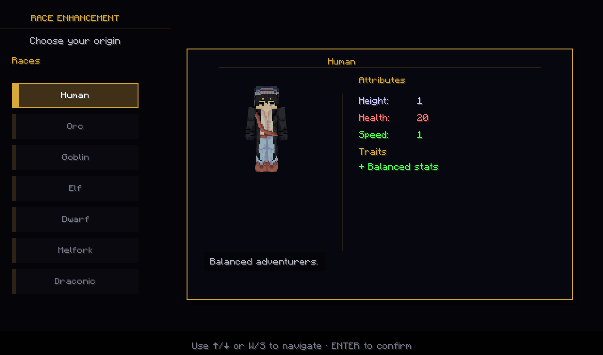

*The race screen previews attributes and traits before the choice is confirmed.*

See [Races and racial traits](#races-and-racial-traits) for the canonical system entry.

### Choosing a class

There is no permanent class-selection screen. The pack's four RPG Series modules provide six archetypes, and the active playstyle comes from the weapon, class book, spells, and matching equipment currently being used.

The six archetypes point toward different loadouts:

- **Archer** — ranged damage; begin with a bow or crossbow and the Archery Manual.
- **Paladin** — front-line protection and damage; pair a heavy melee weapon with the Paladin Libram, and consider a shield.
- **Priest** — healing and support; start with a holy wand or staff and the Holy Book.
- **Rogue** — mobile melee and evasion; quick weapons and dual wielding pair well with the Rogue Manual.
- **Warrior** — heavy melee and control; use slower, heavier weapons with the Warrior Codex.
- **Wizard** — arcane, fire, or frost magic; use a wand or staff with the matching wizard tome.

To activate the full class kit:

1. Obtain a weapon appropriate for the intended archetype. Some caster weapons already provide a basic spell.
2. Find a Spell Binding Table in a village gazebo, or build one and surround it with bookshelves.
3. Create the corresponding class book at the table.
4. Equip the book in the Curios spell-book slot (`Ctrl + G` opens the Curios interface), then hold a compatible weapon. The spell or skill hotbar should expose the available abilities.
5. Test the loadout somewhere safe before spending progression points.

Changing weapons or books is how to try another archetype; choosing a race does not lock the character to a class. See [Classes and playstyles](#classes-and-playstyles).

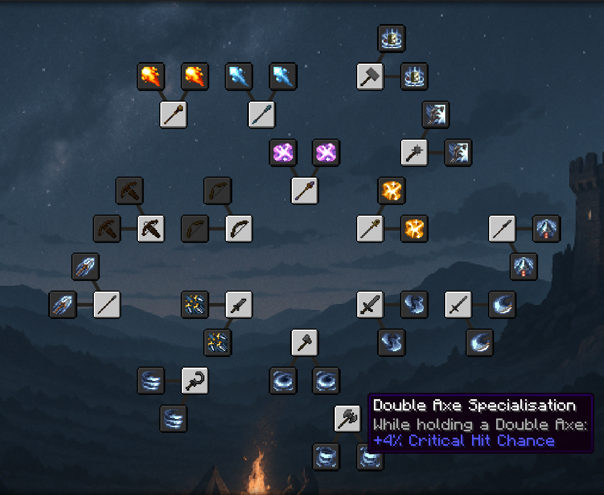

*Spend RPG specialization points in this tree; equip a compatible class book and weapon separately to assemble the loadout.*

*A compatible loadout adds the numbered Spell Engine hotbar without replacing the normal item hotbar.*

### Skills, abilities, spells, and runes

The pack combines two separate progression systems with two sources of active powers. They work together, but their points, abilities, and controls are not interchangeable.

The RPG class and weapon tree (`T`) uses skill points earned through XP to unlock specializations that modify class books, weapon skills, and passive combat effects. Skill Perks (`G`) is a separate, XP-based progression path for broader survival, mobility, utility, and combat benefits. Their points and reset methods are separate; spending or resetting one does not change the other.

A compatible class book or weapon supplies class abilities through the Spell Engine hotbar. Its displayed slot keys depend on the equipped loadout; hold `Left Ctrl` with a number key to select the corresponding ordinary hotbar item instead. Vital Relics are a separate source of active powers: in this profile, press `X` to cast the selected relic spell and `Shift + X` to switch spells. Check the equipped relic's tooltip and cooldown before relying on its ability.

The RPG tree is content supplied through Pufferfish's Skills; Pufferfish's Skills itself is the framework behind the `T` screen. The tree contains meaningful branches rather than one mandatory route, and a dedicated reset item can refund its points if a build needs to be changed later.

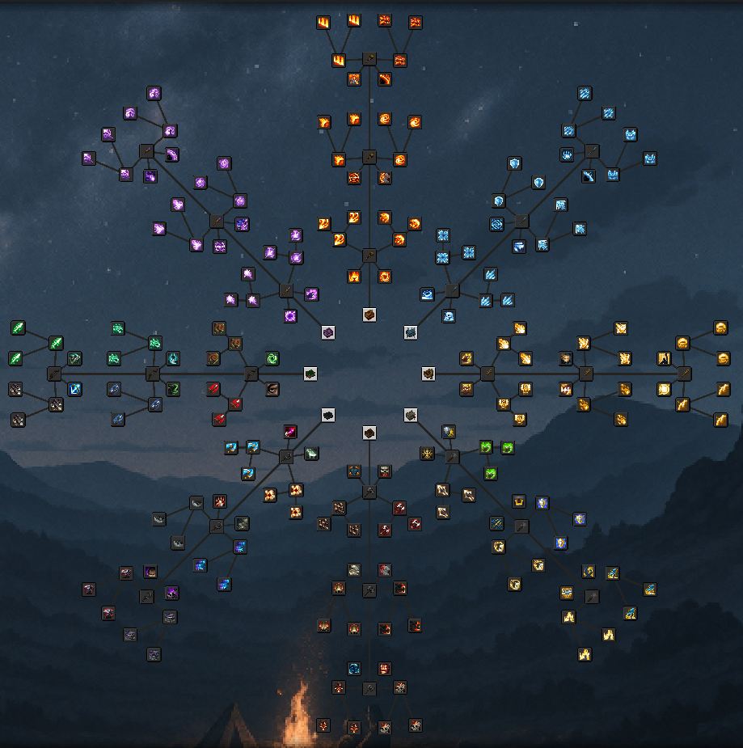

*Press `T` to inspect the large class and weapon tree before spending its skill points.*

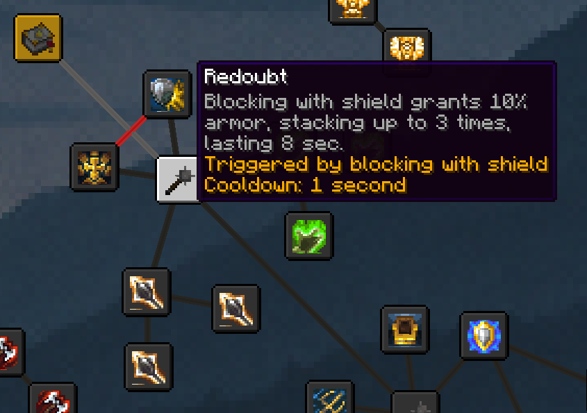

*Press `G` for the separate general perk tree; hovering a node explains its effect, trigger, and cooldown.*

Class spells consume runes, much like bows consume arrows. Runes can be crafted normally, while the Rune Crafting Altar produces them more efficiently. Treat a displayed class ability as a short action loop: confirm that its icon is available, select the intended slot, meet any target or resource requirement, then wait for its cooldown before trying again. Some abilities require the compatible weapon to remain in hand. If a spell refuses to cast, check the equipped book and weapon, selected ability, cooldown, and rune cost before assuming a keybind is broken.

Better Combat changes ordinary weapon attacks into aimed swings, combos, and dual-wield sequences. Aim deliberately: attack direction and timing matter more than rapid clicking, and a combo rewards completing its sequence. Combat Roll adds a directional dodge on `E`; rolling has a cooldown and can consume hunger, so use it to evade a telegraphed hit or leave a dangerous position rather than as unlimited movement. Some RPG-tree passives trigger from attacks, damage, evasion, or rolling; practice a full sequence on ordinary mobs and a Target Dummy before relying on it in a boss fight.

See [Skill trees and character progression](#skill-trees-and-character-progression), [Abilities, spells, runes, and resources](#abilities-spells-runes-and-resources), and [Combat controls and dodge rolling](#combat-controls-and-dodge-rolling).

### First-session checklist

Complete these steps before the first long expedition:

- Before playing, use the [complete recommended keybind tables](#essential-keybinds-and-conflict-resolution) to set `P` for races, `T` for the RPG tree, `G` for Skill Perks, `E` for rolling, `B` for parties, `O` for Alex's Caves, and `X` / `Shift + X` for Vital Relics.
- Open the race menu with `P`, read every trait, and choose the character's persistent race.
- Pick an initial archetype from the role guide above, then obtain its appropriate weapon and class book.
- Equip the class book in the Curios spell-book slot and hold a compatible weapon; confirm that the Spell Engine hotbar appears and check any rune cost. If you equip a Vital Relic, test its active spell separately with `X` to cast and `Shift + X` to switch spells.
- Open `T` and inspect the class and weapon branches before spending points. Read each node's prerequisites and what it modifies; some nodes affect a weapon skill or spell you must already have equipped. Open `G` separately and remember that its perks spend XP.
- Practice a full basic attack sequence and one directional roll in a safe area.
- In multiplayer, create or join a party with `B`, review friendly fire and XP sharing, and set the party HUD to the recommended right-side vertical layout.
- Learn the downed and grave screens before carrying valuable equipment far from the base.
- Place Paper Doll at the upper-left and Coordinates Display directly beneath it so neither overlaps the party HUD.

### Parties, downed players, and death

Press `B` to create, browse, or manage a Better Party group. Parties can be public, invite-only, or password-protected; they support leader, officer, and member roles. The leader can manage friendly-fire protection, nearby XP sharing, and the party-member locator when the server permits them. Use `/p <message>` for party chat.

The recommended HUD layout places the party roster vertically on the right. Each player can move and scale that HUD independently, so one player's layout does not rearrange everyone else's screen.

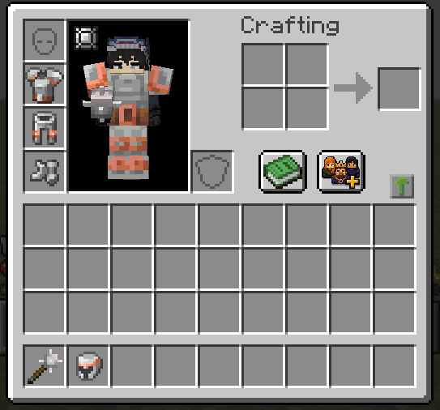

*The Better Party shortcut is also available from the inventory when the `B` binding is forgotten.*

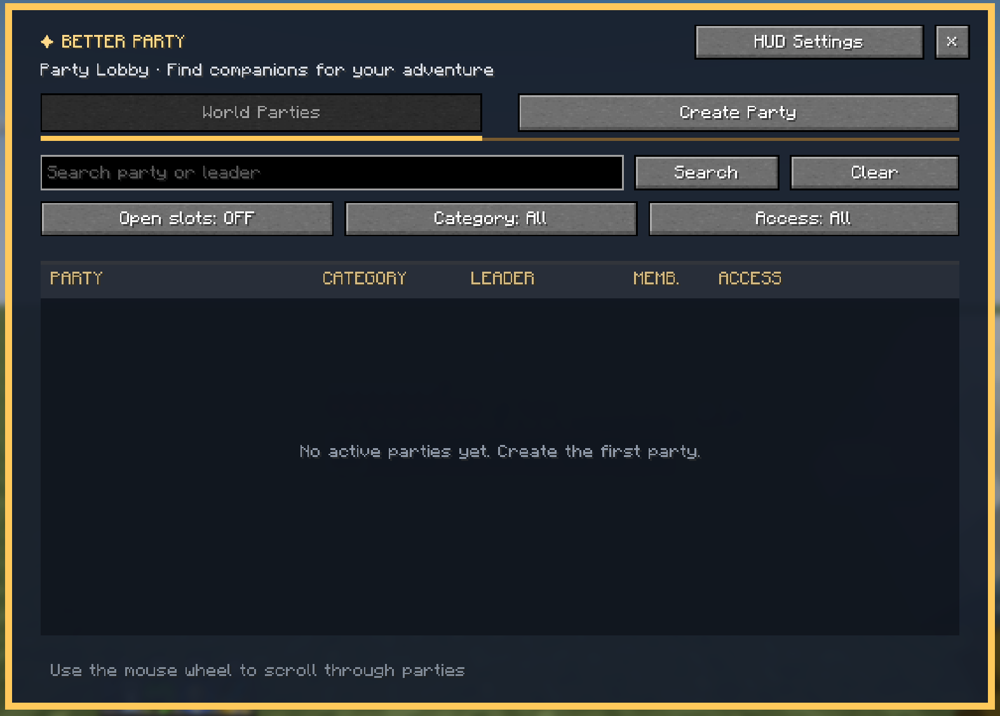

*The lobby is used to find or create a party; HUD Settings controls the roster shown during play.*

Death recovery has several layers:

1. **Downed window:** PlayerRevive gives teammates a limited opportunity to rescue a fallen player before death completes. Treat the on-screen timer as authoritative because server settings can change the duration.
2. **Revival and grave:** Better Revive stores inventory, equipment, supported equipped slots, and experience in a protected grave. A helper can throw a Revive Potion near the grave or, when manual revival is enabled, interact with the grave to request the consent-based Life Pulse minigame. The downed player may instead choose **Respawn now (no revival)**.
3. **Compatibility handoff:** The installed Better Revive × PlayerRevive bridge connects both systems and prevents repeated bleed-out or death loops. Players should follow the current on-screen prompt rather than trying to restart an earlier revive state.
4. **Final respawn:** If revival is declined, fails, or times out, Better Respawn normally places the player near the death location. A valid nearby bed or respawn anchor, returning from the End, and deaths across dimensions can use different placement rules.
5. **Recovery:** The grave remains the source of stored items after an ordinary respawn. Better Revive supplies a Grave Compass for an active grave; use it to review the grave's location, dimension, distance, and contents. At the grave, right-click it to recover the stored items. If the inventory cannot accept everything, the remainder stays protected in the grave rather than being overwritten or discarded.

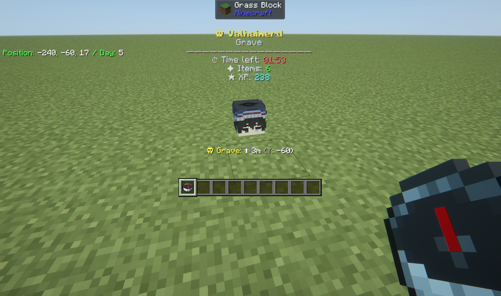

*The grave overlay identifies its owner, remaining protection time, stored items and experience, and recovery distance.*

See [Death, revival, graves, and respawning](#death-revival-graves-and-respawning) and [Parties and multiplayer cooperation](#parties-and-multiplayer-cooperation).

#### Sources for the RPG onboarding

- [Iourus Races](https://modrinth.com/mod/iourus-races)
- [Archers](https://modrinth.com/mod/archers), [Paladins & Priests](https://modrinth.com/mod/paladins-and-priests), [Rogues & Warriors](https://modrinth.com/mod/rogues-and-warriors), and [Wizards](https://modrinth.com/mod/wizards)
- [Skill Tree (RPG Series)](https://modrinth.com/mod/skill-tree), [Pufferfish's Skills](https://modrinth.com/mod/skills), and [Skill Perks](https://www.curseforge.com/minecraft/mc-mods/skill-perks)
- [Spell Engine](https://modrinth.com/mod/spell-engine), [Runes](https://modrinth.com/mod/runes), [Better Combat](https://modrinth.com/mod/better-combat), and [Combat Roll](https://modrinth.com/mod/combat-roll)
- [Better Party](https://modrinth.com/mod/better-party), [PlayerRevive](https://modrinth.com/mod/playerrevive), [Better Revive](https://www.curseforge.com/minecraft/mc-mods/better-revive), [Better Revive × PlayerRevive](https://www.curseforge.com/minecraft/mc-mods/better-revive-x-playerrevive), and [Better Respawn](https://modrinth.com/mod/better-respawn)

## Part II — Character and Core Systems

This part explains how a character is assembled and how its combat systems interact. Race is the persistent foundation; class identity comes from equipment; the RPG trees and general perks add separate progression choices. Treat the weapon, class book, ability bar, armor, and accessories as one loadout, then test the whole combination before investing more experience.

### Races and racial traits

- **Iourus Races** — Adds Human, Elf, Dwarf, Orc, Goblin, Melfork, and Draconic as persistent character identities with different strengths, weaknesses, attributes, and passive behavior.

Race selection defines persistent character traits and belongs at the beginning of character setup. Open the race menu with the recommended `P` binding and read the in-game trait descriptions before confirming. Choose around the way you want to travel and fight, not a single displayed attribute: passive traits and weaknesses can matter outside combat. The seven races share the broader class and skill systems, so no race locks you to a particular archetype. Since a confirmed race is not freely changed by ordinary players, make this choice before long-term progression.

### Classes and playstyles

#### RPG classes

- **Type:** Integrated character-progression suite
- **Primary topic:** Classes and playstyles
- **Also affects:** Combat, Character, Skills, Magic, Equipment
- **Core idea:** Four installed RPG Series modules provide Archer, Paladin, Priest, Rogue, Warrior, and Wizard loadouts through weapons, class books, spells, and matching equipment.
- **Onboarding:** There is no permanent class-selection screen. Follow [Choosing a class](#choosing-a-class) to assemble and test a loadout.

- **Archers** — Adds the Archer class module and its bow-focused equipment and progression options.
- **Paladins & Priests** — Adds the Paladin and Priest class module with defensive, melee, healing, and support progression options.
- **Rogues & Warriors** — Adds Rogue and Warrior class options with agile and martial combat progression.
- **Wizards** — Adds the Wizard class module and its spell-focused equipment and progression options.

### Skill trees and character progression

- **Skill Tree (RPG Series)** — Supplies class and weapon trees that modify spells, add passive combat effects, and turn gathered XP into skill points.
- **Pufferfish's Skills** — Provides the configurable progression framework and the `T` skill-tree screen used by the RPG trees.
- **Skill Perks** — Spends XP on a separate set of general survival, mobility, utility, and combat perks opened with `G`.

The `T` and `G` screens are separate systems. Inspect both before spending points so class specialization and general utility choices remain deliberate.

Use the RPG tree to specialize a chosen class or weapon; use Skill Perks to invest in broader utility that survives a change in combat style. XP gathered during ordinary play feeds both systems, but their points and resets are separate. A point in one screen does not unlock a node in the other.

Their reset methods are also separate. Use an **Orb of Oblivion** to reset and refund points spent in the RPG class tree. The Skill Perks screen has its own **Respec** action; the server can disable it and controls whether spent XP levels are refunded, so read its confirmation result before rebuilding the general perk tree.

### Abilities, spells, runes, and resources

- **Spell Engine** — Connects equipped class books and compatible weapons to the visible ability hotbar, casting rules, targeting, costs, and cooldowns.
- **Runes** — Adds craftable ammunition consumed by class spells.

The installed class modules are separate entries in the RPG Series. **Archers** develops bow-centered combat; **Paladins & Priests** covers defense, healing, and support; **Rogues & Warriors** covers agile and martial combat; and **Wizards** focuses on spellcasting. The available class book, weapon, and skill-tree content determines the exact options in each loadout.

Equip a class book in its Curios slot, hold a compatible weapon, and use the keys displayed on the ability hotbar. Hold `Left Ctrl` with a number key when the normal item hotbar must take priority. If casting fails, read the hotbar message and check the target, cooldown, equipped loadout, and rune cost. Runes can be crafted normally or produced more efficiently with a Rune Crafting Altar.

### Combat controls and dodge rolling

- **Better Combat** — Replaces vanilla melee timing with animated attacks, weapon combos, dual-wield support, and improved hit detection.
- **Combat Roll** — Adds a dodge roll with its own attributes and enchantments.
- **Target Dummy** — Provides a craftable target for testing damage and complete attack sequences.

### Weapons, armor, jewelry, and relics

Equipment is part of the build rather than a simple armor-value ladder. Check attack speed, spell power, healing power, ranged attributes, set bonuses, passive effects, and Curios bonuses before replacing an item solely because its material looks stronger.

#### Building a loadout

Start with a **weapon and class book** that support the same combat rhythm. Add **armor** whose set effects match the chosen class or damage type. Use **Jewelry** in Curios slots to reinforce the role, then add a **Relic** when its active or passive effect complements the build. Finish by refining the setup with enchantments; this order makes each upgrade easier to evaluate.

Use the recommended `Ctrl + G` binding to inspect equipped Curios. Hover equipment and read its full tooltip before comparing it; [Enchantment Insights](#information-overlays-and-tooltips) explains unfamiliar enchantments, while `R` and `U` over an item open its JEI recipe and uses.

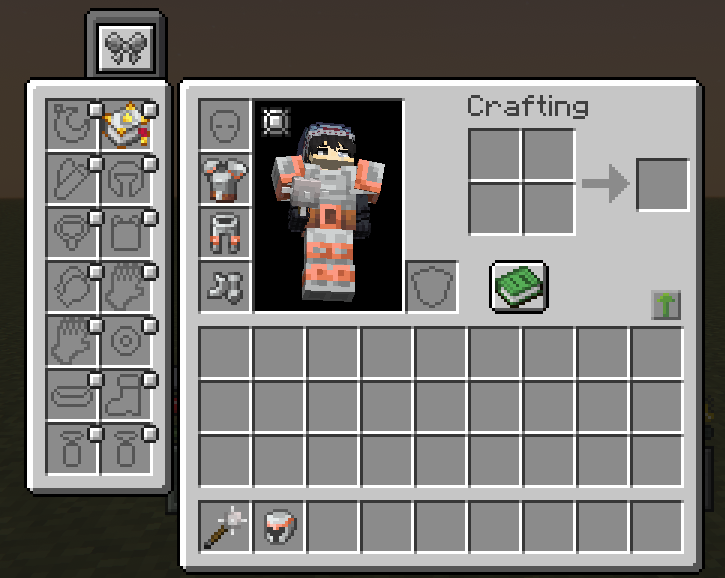

*The Curios screen keeps the spell-book and accessory slots separate from ordinary armor and inventory slots.*

#### Acquisition and upgrade paths

- Class equipment is the practical starting point because it establishes the intended weapon, spell, and attribute combination.
- Jewelry spans several material tiers. Gems can be found underground and crafted into accessories, while village trades and dungeon loot provide alternative sources.
- Relics are primarily adventure rewards from dungeon chests and major enemies, with a smaller craftable selection connected to Jewelry materials. They are build-changing accessories, not ordinary armor upgrades.
- Arsenal weapons are rare loot rather than normal crafting goals. Look for them in major boss rewards and valuable dungeon chests; every Arsenal weapon carries at least one built-in passive spell.
- Armory sets upgrade existing RPG class armor with materials obtained from rare structure loot and bosses. Their set and spell-modifier bonuses reward keeping the build focused instead of mixing pieces only by armor value.

#### Included equipment systems

- **Alex's Caves equipment** — Exploration rewards support new combat options. See [Alex's Caves](#alexs-caves).
- **Stellarity equipment** — End progression includes additional equipment systems. See [Stellarity](#stellarity).

- **Arsenal** — Places legendary RPG weapons behind exploration and combat rewards instead of ordinary crafting.
- **Armory** — Adds RPG armor sets with distinct designs and set bonuses.
- **Jewelry** — Adds Curios-equipped rings and necklaces with combat attributes, supported by mining, crafting, trading, and loot.
- **Relics** — Adds Curios-equipped trinkets with active or passive mechanics that can reshape a build.
- **Vital Relics** — Adds equippable relics with attributes, passive effects, and optional active abilities; combinations can change combat and exploration, so read each relic's tooltip and cooldown HUD.
- **Moonstone** — Adds an integrated adventure-and-equipment progression with accessories, challenges, and hostile encounters. Its guidebook explains how to discover and obtain its content; use it rather than treating every item as ordinary loot.
- **Tool Belt** — Stores tools and other eligible non-stackable items in a wearable belt, then lets you select them from a radial menu. Upgrade the belt with pouches for more slots; use `Shift + Q` to open the belt-slot inventory and `Q` to swap tools in the recommended profile.
- **Dedicated Elytra Slot** — Adds a separate inventory slot for an Elytra so it can be equipped alongside a chestplate. Put the Elytra in that slot through the inventory; flight remains the familiar vanilla Elytra workflow.
- **Too Many Bows** — Expands ranged builds with bows that have different abilities and combat attributes.
- **Arrow+** — Adds craftable arrow tiers with different damage levels using familiar materials.
- **Fletching Recipe** — Gives the fletching table a crafting interface for efficient ordinary-arrow production and explosive arrows.
- **Shield Upgrades** — Adds durable specialized shields whose attributes or defensive effects support different situations.
- **Enchantments collection** — A group overview for the installed enchantment modules below; each adds a distinct enchantment family.
- **Ice Enchantments** — Adds Frost Aspect for swords and Frost for bows, applying freezing damage and slowing targets; their fire-enchantment counterparts are incompatible.
- **Air Jump Enchantment** — Adds a boot enchantment that grants an extra jump while falling.
- **Attack Speed Enchantment** — Adds an enchantment that shortens the weapon's attack cooldown, increasing attack speed.
- **Double Hit Enchantment** — Adds an enchantment that can trigger an additional hit.
- **Downfall Enchantment** — Adds a boot enchantment that creates a shockwave when the wearer hits the ground.
- **Life Steal Enchantment** — Adds a weapon enchantment that steals health from the target; higher levels restore more health.
- **Ly-Fangs Enchantment** — Adds a combat enchantment; check its tooltip for the exact activation and equipment rules.
- **Spiky Enchantment** — Adds a shield enchantment that damages attackers who are blocked; higher levels increase the damage.
- **Thunder Strike Enchantment** — Adds a mace enchantment that summons lightning when a charged attack lands.
- **True Shot Enchantment** — Adds a bow enchantment that makes arrows ignore gravity.

#### Ranged and defensive equipment

Too Many Bows changes more than appearance: bow damage, draw speed, ranged scaling, and unique abilities can make two bows behave very differently. Better Combat supplies the shared ranged-combat handling, while Arrow+ and Fletching Recipe expand ammunition and crafting. Use JEI rather than guessing which bow and arrow mechanics can be combined.

Shield Upgrades provides side-grades with different attributes and reactive effects. Choose a shield for the expected hazard instead of treating every new shield as a direct replacement for the previous one.

#### Testing and changing equipment

- **Armor Quick Swap** — Swaps complete armor sets quickly from an inventory or armor stand.

Use a Target Dummy and Floating Damage Indicators to compare complete attack sequences, not only a single hit. Test with the same buffs, distance, runes, arrows, armor, and accessories each time; attack speed, cooldowns, area effects, and passive triggers can make the largest displayed number misleading.

Armor Quick Swap has no required hotkey: right-click an armor piece in the inventory to equip or exchange it, or sneak and right-click an armor stand to swap the full worn set. This is useful for keeping separate combat, travel, or utility sets without manually moving four slots.

### Enchanting and equipment improvement

The pack keeps the vanilla enchanting route but also provides a deterministic alternative. Both still depend on experience and the enchanting setup, so choose the workflow that matches the job instead of assuming one station replaces every other station.

For a quick random offer, use the **Enchanting Table with Easy Magic**: items and lapis stay put, and offers can be rerolled for a small lapis and XP cost. To choose a specific enchantment, use the **Enchanting Infuser**; its stronger options still depend on bookshelves and XP. The **Advanced Enchanting Infuser** can rework finished gear, repair it with XP, or remove enchantments and recover XP. **Easy Anvils** keeps items in place and reduces prior-work penalties. **Universal Enchants** widens equipment compatibility, subject to server configuration.

Use Enchantment Insights tooltips and the station interface to confirm what an unfamiliar enchantment does and whether the current item accepts it. Universal Enchants broadens the rules, but it does not mean every enchantment belongs on every item or that every normally exclusive combination is enabled on this server.

#### Included improvement systems

- **Enchanting Infuser** — Provides basic and advanced stations for choosing, modifying, repairing, or removing enchantments without relying entirely on random offers.
- **Easy Anvils** — Keeps items in anvils and makes combining, repairing, and renaming equipment less punitive.
- **Easy Magic** — Keeps items in enchanting tables and adds a low-cost way to reroll random offers.
- **Universal Enchants** — Broadens which equipment can accept existing enchantments and improves selected vanilla enchantment behavior.
- **DarkSmithing** — Adds custom ways to craft smithing templates.
- **Elytra Trims** — Allows elytra to receive armor trims, dyes, banner patterns, and other visual treatments.
- **Naturally Trimmed** — Applies trims to some equipment generated through mobs, loot, and trades, making found gear visually distinct.
- **Armor Trim Item Fix** — Makes inventory icons show the applied trim pattern instead of a generic trimmed texture.

DarkSmithing makes smithing templates craftable through custom recipes; use JEI for the installed recipes rather than assuming vanilla duplication rules. Trims remain cosmetic unless another item explicitly states otherwise. Naturally Trimmed affects generated equipment, Armor Trim Item Fix changes inventory presentation, and Elytra Trims extends decoration to elytra.

#### Sources for equipment and enchanting

- [Arsenal](https://modrinth.com/mod/arsenal-rpg-series), [Armory](https://modrinth.com/mod/armory-rpg-series), [Jewelry](https://modrinth.com/mod/jewelry), and [Relics](https://modrinth.com/mod/relics-rpg)
- [Vital Relics](https://www.curseforge.com/minecraft/mc-mods/vital-relics), [Moonstone](https://modrinth.com/mod/moonstone), [Tool Belt](https://www.curseforge.com/minecraft/mc-mods/tool-belt), and [Dedicated Elytra Slot](https://www.curseforge.com/minecraft/mc-mods/dedicated-elytra-slot)
- [Too Many Bows](https://www.curseforge.com/minecraft/mc-mods/too-many-bows), [Arrow+](https://www.curseforge.com/minecraft/mc-mods/arrow), and [Shield Upgrades](https://www.curseforge.com/minecraft/mc-mods/shield-upgrades)
- [Enchanting Infuser](https://modrinth.com/mod/enchanting-infuser), [Easy Magic](https://modrinth.com/mod/easy-magic), [Easy Anvils](https://modrinth.com/mod/easy-anvils), and [Universal Enchants](https://modrinth.com/mod/universal-enchants)
- [DarkSmithing](https://modrinth.com/mod/darksmithing), [Armor Quick Swap](https://modrinth.com/mod/armor-quick-swap), and [Target Dummy](https://modrinth.com/datapack/target-dummy)
- [Elytra Trims](https://modrinth.com/mod/elytra-trims), [Naturally Trimmed](https://modrinth.com/mod/naturally-trimmed), [Armor Trim Item Fix](https://modrinth.com/mod/armor-trim-item-fix), and [Fletching Recipe](https://modrinth.com/mod/fletching-recipe)

### Death, revival, graves, and respawning

- **PlayerRevive** — Gives downed players a short rescue window before normal death handling completes.
- **Better Revive** — Protects items and experience in graves, supports consent-based or item-assisted revival, and provides grave recovery tools.
- **Better Respawn** — Normally respawns a player near their death location, with exceptions for nearby spawn points, dimension changes, and returning from the End.
- **Charm of Undying: Reborn** — Lets a Totem of Undying sit in the Curios Charm slot and automatically consumes it to save you on death. Equip the totem before an expedition and remember that it is spent when it activates.
- **Harder Natural Healing** — Changes how quickly natural healing restores health and how much hunger it uses; waking healing and other rules are configurable. The server's current settings determine the actual recovery pace, so carry food and do not assume vanilla regeneration timing.

The installed compatibility bridge connects PlayerRevive and Better Revive so their downed states hand off cleanly instead of repeating. See [Parties, downed players, and death](#parties-downed-players-and-death) for the player flow.

### Parties and multiplayer cooperation

- **Better Party** — Adds public and private parties, roles, shared nearby experience, friendly-fire protection, party chat, and a party HUD.

Open the party menu with `B`; use `/p <message>` for party chat. Adjust the roster's position and scale in Better Party's settings. Party roles, shared experience, protection, and revival coordination are covered in [Parties, downed players, and death](#parties-downed-players-and-death).

## Part III — Adventure and Challenge

This pack rewards exploration, but unfamiliar landmarks can begin boss fights, raids, or persistent threats. Before a long trip, open the world map with `M`, confirm that Coordinates Display can be toggled with `N`, record the route home, and carry supplies for both the journey out and the return.

Treat new terrain as a collection of overlapping systems. A biome can contain a structure from another mod, seasonal effects can change crops or temperature, and each dimension has its own equipment and enemy progression. Identify the destination first, then pack for its likely hazards instead of carrying every tool you own.

### Expedition checklist

- Place or activate a return point before entering a new dimension or beginning a major encounter.
- Carry food, ordinary combat supplies, and any runes or arrows required by the current build.
- Keep one inventory route available for unexpected loot instead of leaving every slot full.
- In multiplayer, form the party with `B` before combat so the HUD, friendly-fire rules, shared experience, and revive flow are already working.
- Treat unfamiliar structures as active encounters. Observe the site, identify exits, and avoid opening containers or activating blocks until the group is ready.
- Watch the sky and chat at night. Blood Moons and other environmental threats can make an otherwise routine return trip unsafe.

### Bosses and major encounters

- **Stellarity encounters** — The End expansion includes major combat progression. See [Stellarity](#stellarity).

- **World Bosses** — Adds shrine-based encounters summoned through rituals, with multiplayer scaling, changing attack patterns, and shared reward caches.
- **Bosslike Ender Dragon** — Reworks the dragon into a multi-phase fight that scales with the number of players and becomes stronger after previous victories.
- **Ultimate Warden** — Turns the Warden into a boss encounter with a visible boss bar, dedicated dungeon, and custom rewards.
- **Gateway of Doom** — Opens timed, wave-based arena encounters with an on-screen boss bar, escalating enemies, and rewards for completing every wave.

Each encounter asks for a different kind of preparation. **World Bosses** begin at a shrine and scale for a group, so treat the site as an arena and bring recovery supplies. The **Bosslike Ender Dragon** can ward recalled crystals; stand in the glowing ring at a pillar's base before breaking one. **Ultimate Warden** requires a Dungeon Key held for 30 seconds to enter its contained boss area; keep the exit key awarded afterward and hold it for 10 seconds to leave. **Gateway of Doom** opens when a Devil Eye finds a safe placement, or through an enabled automatic event; watch its boss bar for wave, enemy count, and timer.

For every major encounter, place the respawn and recovery route first, then clear ordinary enemies around the arena. The Shrine Locator Compass can cycle between World Boss shrine targets, which is safer than searching blindly with ritual items already packed. Gateway enemies are kept near their event area, so regroup outside its boundary instead of dragging the wave toward a base. Hell Wards protect complete chunks from every normal Gateway placement method; right-click a placed Ward to inspect its protected chunks on the built-in map.

Both Bosslike Ender Dragon and Stellarity modify the dragon encounter. Expect their mechanics to overlap, follow the telegraphs and boss-bar state shown by the current server, and do not rely on a vanilla dragon walkthrough.

Before using a summoning item, identify the retreat path and agree on a regroup point. Do not place a shrine or Gateway beside storage or a settlement. After victory, check the arena and nearby ground for rewards before leaving; some drops are part of a mod's progression and may not be replaceable through ordinary crafting.

### Invasions and wave events

- **Invasion** — Starts increasingly difficult Nexus-defense events whose attackers can build, dig, and adapt to the terrain.
- **Illager Invasion** — Adds new illager combat and support roles to raids and places others in structures.
- **It Takes a Pillage** — Adds pillager encampments, fortresses, patrol threats, and related rewards.

These systems are not interchangeable. **Invasion** begins around a placed and activated Nexus, while **Illager Invasion** makes village raids and related encounters more varied, and **It Takes a Pillage** adds hostile pillager locations to exploration.

Do not test a Nexus beside an irreplaceable home. Invasion enemies can bridge gaps, place ladders, and destroy blocks while trying to reach it. Use a prepared defense site, provide sight lines and fallback paths, and move valuable storage outside the likely damage area. A Gateway of Doom is also wave-based, but it is a timed arena challenge rather than a Nexus defense.

### Dangerous nights and environmental threats

#### Withered Lands

- **Type:** Integrated adventure expansion
- **Primary topic:** Dangerous nights and environmental threats
- **Also affects:** Combat, Events, Creatures, Structures, Equipment
- **Core idea:** Makes exploration more hostile through wither-themed enemies, behaviors, encounters, and rewards.
- **Player guidance:** Expect its structures, creatures, and rewards to belong to one hostile theme. Scout new sites from a safe distance and use Jade and JEI to identify unfamiliar content without needing an exhaustive enemy list.

#### The Graveyard

- **Type:** Integrated adventure expansion
- **Primary topic:** Dangerous nights and environmental threats
- **Also affects:** Structures, Creatures, Combat, Equipment
- **Core idea:** Adds graveyard-themed locations, enemies, atmosphere, and adventure rewards.
- **Player guidance:** Graveyard structures are adventure locations rather than decoration. Enter with an escape route, light the surrounding ground, and expect their atmosphere, enemies, and loot to be connected.

- **Blood Moon** — Replaces every fourth full moon with an Overworld event that strengthens hostile mobs, increases phantom pressure, and prevents sleeping through the night.
- **The Darkness Will Find You** — Adds a progression-based Deep Dark curse that can make night, sleep, dark dimensions, sculk spread, and hostile events increasingly dangerous until the player pursues its protection and resolution systems.
- **Armored Foes** — Lets more hostile mob families spawn wearing visible equipment and makes illagers equip armor during raids.

- **Somnora** — Replaces the instant night skip with accelerated world time, including visible sky and weather progression, multiplayer-aware sleeping, plant growth, and configurable ambience.

#### When the night changes

During a Blood Moon, sheltering underground or leaving the Overworld avoids the event, but a bed cannot skip it. If the night is ordinary, Somnora still means sleep advances the world instead of cutting instantly to morning. The Darkness Will Find You can separately make sleep unreliable after its curse begins, so read current messages and effects rather than assuming every failed sleep has the same cause.

### Travel, maps, compasses, and teleportation

- **Waystones** — Adds discoverable and craftable travel points that must be activated before they can be selected as destinations.
- **Bifrost Teleport** — Adds named-marker teleportation using mythic weapons and cinematic Bifrost effects.
- **Explorer's Compass** — Searches for vanilla and modded structures through an item interface.
- **Nature's Compass** — Searches for vanilla and modded biomes and displays information about the selected result.
- **Xaero's World Map** — Builds a full-screen map from terrain the player has explored.
- **Xaero's Map Multiplayer** — Adds multiplayer-oriented features to Xaero's maps.

Use **Xaero's World Map** (`M`) to review terrain you have already explored; pan by dragging and zoom with the wheel. **Coordinates Display** (`N`) keeps position visible, opens its settings with `Ctrl + N`, and can send a position to chat with `Y`. The **Explorer's Compass** locates structures, while the **Nature's Compass** searches biomes; right-click to search and select, and sneak-right-click the Nature's Compass to reset its target. **Waystones** form a return network as you discover and activate them. **Bifrost Teleport** is for named destinations, so establish and verify markers before depending on one as your route home.

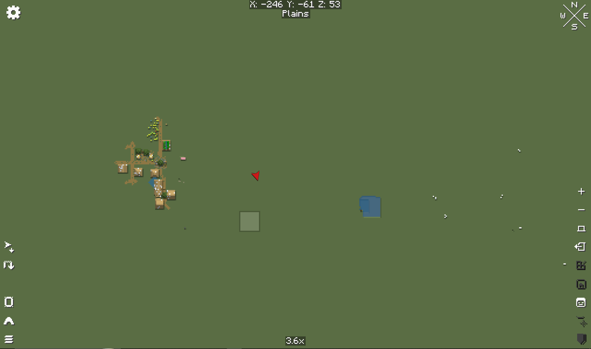

*The map reveals only explored terrain and keeps the current biome and coordinates visible at the top.*

A compass identifies a direction and distance; it does not make the destination safe or automatically map the route. Add a map marker before leaving, and verify that the destination belongs to the current dimension. The world map only reveals explored terrain, so blank regions are unknown—not empty.

### Integrated world and dimension expansions

World-generation changes appear in newly generated terrain. Existing explored chunks normally retain their old layout, so travel beyond familiar borders when searching for a new biome or structure after a pack update.

#### Alex's Caves

- **Type:** Integrated world expansion
- **Primary topic:** Integrated world and dimension expansions
- **Also affects:** Combat, Equipment, World Generation, Creatures
- **Core idea:** Adds rare underground ecosystems with their own creatures, materials, equipment, and progression.
- **Player guidance:** Begin with an Underground Cabin and its Cave Compendium. The book teaches the intended discovery route, while the recommended `O` binding is reserved for equipment that exposes Alex's Caves' special ability action.

#### Better Nether

- **Type:** Integrated dimension expansion
- **Primary topic:** Integrated world and dimension expansions
- **Also affects:** World Generation, Structures, Creatures, Equipment
- **Core idea:** Expands Nether terrain, biomes, vegetation, structures, creatures, and exploration rewards.
- **Player guidance:** Expect the Nether to contain unfamiliar plants, materials, mobs, and large structures. Mark the portal immediately and bring spare ignition because ordinary visual landmarks are less reliable in the denser terrain.

#### Stellarity

- **Type:** Integrated dimension expansion
- **Primary topic:** Integrated world and dimension expansions
- **Also affects:** World Generation, Structures, Creatures, Equipment, Bosses
- **Core idea:** Expands the End with new terrain, structures, enemies, equipment, and progression.
- **Player guidance:** Treat the End as a full adventure dimension rather than a short dragon trip. Strongholds, the dragon, outer-island terrain, End Cities, crafting interactions, and boss encounters are all changed; some Stellarity recipes and rewards do not appear normally in JEI, so preserve written or in-world clues.

- **Biomes O' Plenty** — Adds more than 50 biomes plus matching plants and blocks.
- **Terralith** — Rebuilds Overworld terrain around almost 100 realistic and light-fantasy biomes made from vanilla blocks.
- **William Wythers' Overhauled Overworld** — Reinterprets vanilla biomes with larger, more realistic, and atmospheric terrain.
- **Dungeons Dimensions: Nether** — Brings Minecraft Dungeons-inspired detail and encounters to the Nether.
- **Nullscape** — Reworks End terrain and island generation.
- **Clear End City** — Adds cinematic End structures, void gardens, crashed citadels, and new loot locations.
- **Serene Seasons** — Adds seasonal color, temperature, and environmental changes.
- **Abyssal Ocean** — Generates rare, extremely deep offshore ocean regions that become darker toward bedrock.

Serene Seasons affects more than scenery: weather, temperature, and crop growth can change across the year. Nature's Compass finds a biome; Explorer's Compass finds a structure; neither replaces preparation for the seasonal or dimensional conditions around the target.

The Overworld changes are not one biome pack. Biomes O' Plenty adds its own plants and blocks, Terralith and William Wythers reshape terrain using largely familiar materials, and Serene Seasons changes the calendar across those landscapes. Abyssal Ocean is a rare deep-ocean destination, while Better Nether, Nullscape, and Stellarity alter separate dimensions. To see new generation after an update, travel beyond explored chunks; existing terrain does not retroactively rebuild.

### Structures and dungeons

- **Integrated-expansion structures** — Several world expansions add structures as part of a larger ecosystem. See [Alex's Caves](#alexs-caves), [Better Nether](#better-nether), [Stellarity](#stellarity), and [The Graveyard](#the-graveyard).

- **Dungeons and Taverns** — Adds taverns, ruins, camps, and dungeons throughout the world.
- **Dungeons and Taverns overhauls** — A group overview for the four standalone DnT structure overhauls listed below.
- **DnT Ancient City Overhaul** — Reworks ancient-city exploration as a standalone Dungeons and Taverns series module.
- **DnT Mineshaft Overhaul** — Reworks mineshaft generation with a distinct exploration layout.
- **DnT Pillager Outpost Overhaul** — Reworks pillager outposts as larger exploration and combat destinations.
- **DnT Stronghold Overhaul** — Reworks stronghold generation and exploration.
- **Awesome Dungeon collection** — A group overview for the Overworld, End, and Ocean dungeon modules listed below.
- **Awesome Dungeon** — Adds dungeon structures and combat exploration to the Overworld.
- **Awesome Dungeon End Edition** — Adds dungeon structures to End exploration.
- **Awesome Dungeon Ocean Edition** — Adds dungeon, temple, and ruin structures to ocean exploration.
- **Moog's structure collection** — A group overview for the six world-structure modules listed below.
- **Moog's Bountiful Structures** — Adds varied structures and exploration sites to the world.
- **Moog's End Structures** — Adds new structures to End exploration.
- **Moog's Nether Structures** — Adds structures and landmarks to the Nether.
- **Moog's Ocean Structures** — Adds structures to ocean exploration.
- **Moog's Temples Reimagined** — Adds redesigned temple structures to explore.
- **Moog's Voyager Structures** — Adds structures intended to create new exploration destinations.
- **Towns and Towers** — Expands villages, pillager outposts, and ships while keeping a vanilla-like style.
- **Explorify** — Adds lightweight exploration structures designed to blend with vanilla generation.
- **ATi Structures: Vanilla Edition** — Adds a collection of custom structures and dungeons built with vanilla materials.
- **Much More Dungeons** — Adds more dungeon layouts and exploration targets.
- **Towers of Chambers** — Turns trial chambers into large, vertical combat towers.
- **Underground Villages** — Generates functioning villages below ground.
- **Ocean Lily Pad Village** — Generates villages built across the ocean surface.
- **Antique Trading Ship** — Places a discoverable villager trading ship in ocean biomes.
- **Hopo Better Underwater Ruins** — Replaces small underwater ruins with larger and more interesting sites.
- **Improved Village Placement** — Chooses terrain that produces more natural village layouts.
- **Gazebos** — Adds village gazebos that contain small spell libraries.

#### Exploring generated structures

Use this same loop for unfamiliar structures without requiring a room-by-room spoiler:

1. Mark the entrance and identify a retreat route before descending or activating anything.
2. Use Jade to identify unfamiliar blocks and entities, then `R` and `U` over recovered items to inspect their recipes and uses in JEI.
3. Secure one area at a time. Structure mods can overlap with the pack's expanded hostile roster, so a familiar building shape does not guarantee familiar enemies.
4. Keep unique books, maps, templates, keys, and named components until their purpose is understood.
5. Recheck villages for useful services. Gazebos can supply spell libraries, guards can protect settlements, and some structure overhauls change where progression landmarks appear.

### Creatures and hostile mobs

- **Alex's Caves creatures** — Cave-specific creatures belong to the broader cave ecosystem. See [Alex's Caves](#alexs-caves).
- **Better Nether creatures** — Nether creatures are documented with their dimension systems. See [Better Nether](#better-nether).
- **Stellarity creatures** — End creatures are documented with their dimension progression. See [Stellarity](#stellarity).

#### Shroomcraft

- **Type:** Integrated adventure expansion
- **Primary topic:** Creatures and hostile mobs
- **Also affects:** Creatures, Farming, Food, Building
- **Core idea:** Adds mushroom creatures, crops, colorful shroomwood, and connected survival content.
- **Player guidance:** Treat its creatures, cultivation, food, and building materials as one ecosystem. Use observed behavior, Jade identification, and JEI recipes instead of assuming every mushroom creature is either hostile or decorative.

- **Alex's Mobs** — Adds a large roster of real and fantasy creatures with distinct behaviors and rewards.
- **Animal Garden collection** — A group overview for the individual wildlife modules listed below; each module adds its named animal.
- **Animal Garden: Bull Shark** — Adds bull sharks, an aggressive aquatic creature; take care when exploring its habitat.
- **Animal Garden: Capybara** — Adds greater capybaras to the world.
- **Animal Garden: Fennec Fox** — Adds fennec foxes to the world.
- **Animal Garden: Harp Seal** — Adds harp seals to the world.
- **Animal Garden: Hippopotamus** — Adds hippopotamuses to the world.
- **Animal Garden: Lion** — Adds lions to the world.
- **Animal Garden: Narwhal** — Adds narwhals to aquatic environments.
- **Animal Garden: Owl** — Adds owls to the world.
- **Animal Garden: Prairie Dog** — Adds prairie dogs to the world.
- **Animal Garden: Red Panda** — Adds red pandas to the world.
- **Animal Garden: Red River Hog** — Adds red river hogs to the world.
- **Animal Garden: Spotted Hyena** — Adds spotted hyenas to the world.
- **Animal Garden: Springhare** — Adds springhares to the world.
- **Animal Garden: Yellow Mongoose** — Adds yellow mongooses to the world.
- **Ender Zoology** — Adds hostile mobs designed to feel like extensions of the vanilla roster.
- **Lullaby's Mobs** — Adds additional custom hostile creatures.
- **Mutants and Zombies** — Adds stronger mutant zombie enemies.
- **Moblets** — Adds small and baby variants of existing mobs.
- **Mounts and Monsters** — Adds rideable creatures and new monsters.
- **Craftable Creatures Evolution** — Makes mobs and mob spawners obtainable through crafting-based progression.
- **Ribbits** — Adds social frog-like villagers to swamps.
- **Guard Ribbits** — Adds armed protectors for Ribbit settlements.
- **Guard Villagers** — Adds armed defenders to ordinary villages.
- **Goblin Traders** — Adds wandering goblins with unusual trades.
- **Party Creepers** — Replaces destructive creeper damage with a decorative party-style explosion.

Do not judge an unfamiliar creature only by its model. Watch whether it is passive, defensive, territorial, tameable, rideable, or openly hostile before approaching. Jade supplies the name and health information; JEI can explain known drops and uses without turning this handbook into a species catalogue. Guard Villagers and Guard Ribbits are settlement defenders, while Goblin Traders and Ribbits are social or trading encounters rather than ordinary hostile spawns.

### Companions, pets, villagers, and settlements

- **Companions: Dogfolk** — Adds dogfolk companions.
- **Wild Pets** — Makes polar bears, pandas, and foxes tameable; tamed bears can also be ridden.
- **Puffsprout** — Adds a small companion that learns over time.
- **Animal Pen** — Stores groups of farm animals in a single block to simplify husbandry and reduce entity load.
- **Compact Villagers** — Lets players carry villagers and trade through compact booths.
- **Name Tag Upgrade** — Allows on-the-go renaming and adds convenience improvements to name-tag use.
- **Pet Vault** — Stores, summons, and manages owned pets and mounts through the Keeper's Locket radial menu.
- **Pet Status** — Exposes useful health and status information for owned pets.
- **Iron Wolf Armor** — Adds protective equipment for wolves.

For owned pets, use `Shift + R` to review Pet Status and `R` to open the Pet Vault radial menu. Both shortcuts are listed in the Part I controls tables; Pet Vault is easiest to use away from an item-hover context. Better Party uses `B` and manages players, not pets.

Pet Status is the quickest health and location check before travel; unloaded pets show last-known rather than live information. To begin using Pet Vault, equip a Keeper's Locket in its Curios necklace slot and right-click a tamed companion you own to register it. In the `R` radial menu, left-click that pet's slice to summon or store it. Right-clicking a summoned companion unregisters it permanently from the vault but leaves the animal in the world, so do not use that interaction when the intent is only to store it. Animal Pen and Compact Villagers reduce crowded entity management at settlements; verify that a creature or villager is stored safely before changing or removing the containing block.

#### Sources for adventure and exploration

- [World Bosses](https://www.curseforge.com/minecraft/mc-mods/world-bosses), [Bosslike Ender Dragon](https://www.curseforge.com/minecraft/mc-mods/bosslike-ender-dragon), [Ultimate Warden](https://www.curseforge.com/minecraft/mc-mods/ultimate-warden), and [Gateway of Doom](https://modrinth.com/mod/gateway-of-doom)
- [Invasion Mod Fork](https://modrinth.com/mod/invasion-mod-unofficial), [Illager Invasion](https://modrinth.com/mod/illager-invasion), and [It Takes a Pillage Continuation](https://modrinth.com/mod/it-takes-a-pillage-continuation)
- [Withered Lands](https://modrinth.com/mod/withered-lands), [The Graveyard unofficial port](https://www.curseforge.com/minecraft/mc-mods/the-graveyard-unofficial-port), [Blood Moon](https://modrinth.com/datapack/ks-blood-moon), [The Darkness Will Find You](https://modrinth.com/mod/the-darkness-will-find-you), [Armored Foes](https://modrinth.com/mod/armored-foes), and [Somnora](https://www.curseforge.com/minecraft/mc-mods/somnora)
- [Waystones](https://modrinth.com/mod/waystones), [Explorer's Compass](https://www.curseforge.com/minecraft/mc-mods/explorers-compass), [Nature's Compass](https://www.curseforge.com/minecraft/mc-mods/natures-compass), and [Xaero's World Map](https://modrinth.com/mod/xaeros-world-map)
- [Alex's Caves](https://modrinth.com/mod/alexs-caves), [BetterNether](https://modrinth.com/mod/betternether), [Stellarity](https://modrinth.com/datapack/stellarity), and [Serene Seasons](https://modrinth.com/mod/serene-seasons)
- [Pet Status](https://www.curseforge.com/minecraft/mc-mods/pet-status) and [Pet Vault](https://www.curseforge.com/minecraft/mc-mods/pet-vault)

## Part IV — Survival and Creation

These systems turn gathered resources into long-term infrastructure. The useful order is simple: establish repeatable food, organize portable and base storage, then add faster building, item routing, vehicles, and player trading as those needs appear.

Think of this part as a set of work loops. Gathering turns tools and time into materials; cooking turns ingredients into food and effects; storage preserves and routes output; building converts materials into infrastructure; trade moves surplus between players. A new feature is most useful when it closes one of these loops for your base or expedition.

### Resource gathering and repetitive actions

- **OneKeyMiner** — Adds vein mining, crop harvesting, and automatic replanting.

Hold the recommended `Grave Accent` key while mining, farming, or planting to chain matching actions. OneKeyMiner still consumes the relevant tool durability and can be limited by hunger, durability thresholds, block limits, and server settings, so inspect the tool before clearing a large group.

Try a short chain on a small vein or crop row before holding the action near valuable blocks. The chain still needs a suitable tool and spends its durability; it can use durability much faster than a single break.

### Farming, food, and cooking

- **Shroomcraft cultivation** — Mushroom crops connect to a wider creature and building ecosystem. See [Shroomcraft](#shroomcraft).
- **Starcatcher food and collection** — Fishing rewards connect collection systems with food and equipment. See [Starcatcher](#starcatcher).

#### Farmer's Delight

- **Type:** Integrated survival or profession expansion
- **Primary topic:** Farming, food, and cooking
- **Also affects:** Farming, Food, Equipment, Building
- **Core idea:** Expands farming, cooking tools, food preparation, meals, and kitchen-centered survival.
- **Player guidance:** Build around preparation, heat, and serving rather than treating every meal as an ordinary crafting-grid recipe. Use JEI to identify the required workstation and container for the food being made.

- **Kaleidoscope Cookery** — Adds more ingredients and recipes around the cooking loop.
- **Better Rotten Flesh** — Adds useful ways to process and consume rotten flesh and new zombie-feeding behavior.
- **Universal Bone Meal** — Makes bone meal work on a wider range of plants.
- **No Crop Destruction** — Prevents farmland and crops from being trampled during normal play.

#### Kitchen workflow

The kitchen has several distinct jobs. **Prepare ingredients** on cutting boards and other stations shown by JEI; preparation can improve yield or create an ingredient for the next step. **Cook** on the required heated cookware or stove. **Batch meals** use pots and may require a serving container. **Kaleidoscope Cookery** adds its own chopping, milling, cooking, and steaming recipe categories, so similarly named stations are not interchangeable. Some feast and display blocks serve portions in the world instead of behaving like ordinary food items.

Farmer's Delight and Kaleidoscope Cookery overlap in theme but do not make every workstation interchangeable. Search the desired result in JEI, open its recipe with `R`, and follow the station shown there. Better Rotten Flesh provides a use for a normally poor food source, but its processed results and zombie interactions should still be tested away from villagers and livestock.

Serene Seasons can change crop growth across the year. Universal Bone Meal broadens which plants accept bone meal, while No Crop Destruction protects the farm from ordinary trampling; neither guarantees that every crop will grow equally well in every season or environment.

When a crop is slow, check light, hydration, season, and the plant's own growth conditions before replacing the farm. Use bone meal only after confirming that the plant accepts it, and protect paths around farmland even though the pack prevents ordinary trampling.

### Fishing and collection systems

#### Starcatcher

- **Type:** Integrated survival or profession expansion
- **Primary topic:** Fishing and collection systems
- **Also affects:** Food, Equipment, Events, Multiplayer
- **Core idea:** Adds collectible fish, fishing minigames, equipment, trophies, tournaments, and a guidebook.
- **Player guidance:** Fish are selected by conditions such as biome, weather, time, and elevation. Use the guide and catalogue to plan where to fish instead of expecting one location to provide every catch.

#### Starcatcher first-catch flow

1. If the guide is missing, fish once with a vanilla rod to receive the Starcatcher guide and rod. Open the guide with `Ctrl + Space` and review its help pages before choosing a fishing location.
2. Prepare the rod and tackle box. Hooks, bobbers, and bait alter the setup, and uncommon catches can require the right combination.
3. Cast normally. When the minigame begins, follow its on-screen target and use `Space` for **Minigame Hit**; this shares Jump safely because the action is minigame-specific.
4. Check the catalogue after the catch. It records discoveries and their measurements, while JEI covers recipes that the guide does not.
5. During a tournament, use `Tab` for the tournament overlay. This intentionally shares the key with Inventory because the contexts are separate.
6. Decide whether the catch belongs in food preparation, a display or aquarium, the collection, or the selling system.

Starcatcher's difficulty and presentation have accessibility settings, including an option to disable the minigame. Treat the server configuration as authoritative. This handbook explains the loop without listing every fish or hidden condition.

### Potions and alchemy

#### Alchemia

- **Type:** Integrated survival or profession expansion
- **Primary topic:** Potions and alchemy
- **Also affects:** Magic, Equipment, Food
- **Core idea:** Reimagines potion brewing as a simplified, Potion Craft-inspired alchemy system.
- **Player guidance:** Alchemia is an ingredient-navigation system rather than a replacement skin for the Brewing Stand. Learn it at an Alchemical Cauldron and keep ordinary brewing recipes as a separate workflow.
- **Potion Time Stacker** — Lets repeated potion effects extend their remaining duration.
- **Potions Stack** — Allows ordinary potions to stack in small groups.

#### Alchemia workflow

1. Place an ordinary cauldron over a campfire to create the Alchemical Cauldron setup.
2. Add discovered alchemy ingredients. Each one moves the mixture's bias in a direction on the radial effect map.
3. Continue adjusting the mixture until the water changes to the desired effect. Combining paths can produce a potion with more than one effect; the last effect added is generally the strongest.
4. Use glass bottles on the completed cauldron to collect the result. One full cauldron can fill four bottles.
5. Record useful ingredient paths and confirm unfamiliar ingredients or outputs with JEI before consuming the result.

Potion Time Stacker changes repeated use: drinking another potion with the same active effect adds duration instead of simply replacing the old timer. Splash-potion stacking and the maximum duration are server-configurable, so check the actual effect timer after use. Potions Stack changes inventory capacity only; potions still stack only when their item data matches.

Keep a note of successful Alchemia ingredient paths for effects you use often. Ingredient positions matter, and a small adjustment can move the route away from the intended result. Make one experimental batch at a time, confirm the result in the tooltip, then scale up ingredients for a supply run.

### Building and decoration

#### Macaw's building collection

- **Type:** Integrated building expansion
- **Primary topic:** Building and decoration
- **Also affects:** Building, Storage
- **Core idea:** Adds coordinated bridges, doors, fences, furniture, decorations, lights, paintings, paths, roofs, stairs, trapdoors, and windows.
- **Player guidance:** Treat the collection as coordinated block families. Search by the source mod in JEI or filter by the material being used instead of browsing every decorative variant individually.

- **Macaw's Bridges** — Adds bridge designs and variants for crossing rivers, ravines, and other gaps.
- **Macaw's Doors** — Adds additional door designs and wood variants.
- **Macaw's Fences and Walls** — Adds coordinated fence and wall variants for building.
- **Macaw's Furniture** — Adds craftable furniture and interior details.
- **Macaw's Holidays** — Adds seasonal and holiday-themed decorative blocks.
- **Macaw's Lights and Lamps** — Adds decorative lighting options.
- **Macaw's Paintings** — Adds paintings in additional sizes and designs.
- **Macaw's Paths and Pavings** — Adds path and paving block variants.
- **Macaw's Roofs** — Adds roof shapes and material variants.
- **Macaw's Stairs** — Adds additional stair designs and variants.
- **Macaw's Trapdoors** — Adds trapdoor designs in additional wood variants.
- **Macaw's Windows** — Adds window designs and building details.

- **Display Delight** — Adds decorative ways to display food and related items.
- **Functional Sculptures** — Adds a collection of craftable statues, monuments, and memorials for decorative builds.
- **Armor Statues** — Unlocks detailed posing and customization for armor stands.
- **Stoneworks** — Adds building variants for vanilla stone families.
- **Effortless Building** — Adds tools for placing and editing large shapes and repeated structures quickly.
- **Pro Placer** — Improves precise placement, reach-based building, and bridging.
- **Stonecutting Upgrade** — Expands the stonecutter interface, remembers recipes, and supports quick material refills.
- **Arcane Lanterns** — Uses catalysts to give lanterns different magical area effects.
- **Barricades** — Adds defensive barricades, contact-damage obstacles, and resettable traps.

#### Bulk-building workflow

1. Prototype a small section with ordinary placement and confirm the palette, orientation, and block count.
2. Hold `Left Alt` to open Effortless Building's radial menu, choose a shape, and review its fill and replacement options.
3. With the building block selected, right-click the first position, aim at the endpoint, and right-click again to place the previewed shape. Survival use consumes the correct blocks from inventory.
4. Use `Ctrl + Z` and `Ctrl + Y` for undo and redo when the result is wrong. Server limits still control reach, shape size, breaking, and replacement behavior.
5. Use mirrors or arrays for repeated sections only after one section is correct. Pro Placer supports precise single-block work and bridging where a bulk shape would be excessive.

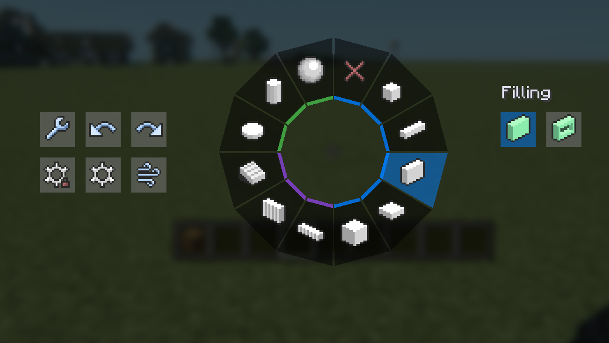

*Hold `Left Alt` to choose a building shape and configure whether it is filled or hollow.*

Effortless Building can place, break, or apply tool interactions across a selected shape. Check the preview before confirming, especially near storage, redstone, or irreplaceable blocks. The Randomizer tool can vary a palette, while an empty weighted slot can intentionally leave gaps.

Stonecutting Upgrade expands the stonecutter recipe area and remembers the previous selection. Press `Space` inside the stonecutter to refill one input item, or hold `Shift` with `Space` to refill a stack. These are interface actions, not global building keybinds.

Armor Statues provides a dedicated interface for poses, body-part rotation, visibility, alignment, and display options. Arcane Lanterns uses a Lantern Maker and catalysts to create area effects; read the JEI description before placement because some effects help farms or movement while others repel, contain, debuff, or damage entities. Barricades and traps are functional defenses, so test their reset and contact behavior before placing them on a shared path.

### Storage and inventory management

- **Sophisticated Backpacks** — Adds upgradeable portable storage with functional upgrade slots.
- **Tom's Simple Storage** — Joins ordinary containers into one searchable storage network.
- **Linked Chests** — Lets separate chests share an inventory.
- **Easy Shulker Boxes** — Allows shulker boxes to be used directly from the inventory.

Choose the storage system by the job. **Sophisticated Backpacks** provide portable capacity and configurable upgrades; `V` opens an equipped pack. **Tom's Simple Storage** connects nearby containers to one searchable network, accessed at a placed terminal. **Linked Chests** share inventories between locations through matching dye channels, with personal channels and a portable pouch available. **Easy Shulker Boxes** lets you browse a packed shulker without placing it.

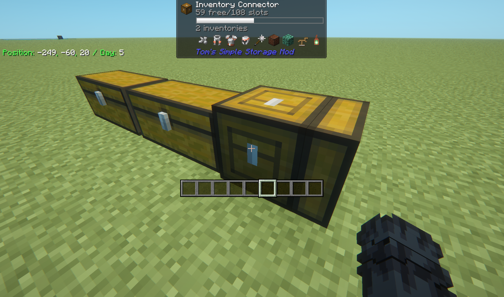

*The connector indexes linked inventories; Jade reports their combined capacity and connected-container count.*

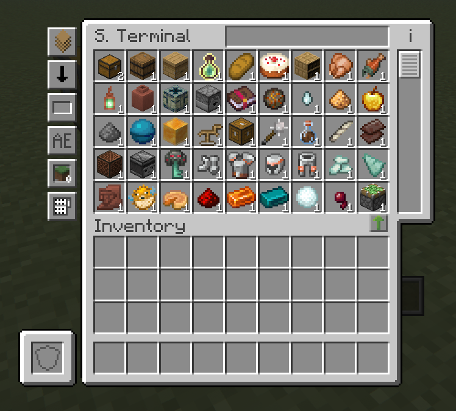

*The terminal browses the network as one inventory while the items remain in their connected containers.*

Sophisticated Backpacks can also be placed as blocks and used with hoppers or other inventory automation. Keep its role distinct from a Tom's network: a backpack is a portable container with upgrades, while Tom's Simple Storage indexes connected inventories rather than moving everything into one giant chest.

Linked Chests share data by channel, not by physical adjacency. Label the three-color combination, decide whether the channel is shared or personal, and test a second chest before trusting it with important materials. Easy Shulker Boxes are an inventory convenience; they do not expand a storage network.

Set a Linked Chest channel with dyes on its three color controls; any chest using the same ordered combination opens that channel's shared inventory. Use a diamond on the latch to convert it to a larger player-specific channel. To configure portable access, sneak-use a Linked Pouch on the target chest so the pouch copies that channel.

### Item transport and logistics

- **Golden Hopper** — Adds a hopper with configurable filtering behavior.
- **Hopper Gadgetry** — Adds more capable hopper controls and item-routing tools.
- **Sophisticated Inventory Interactions** — Brings search, sorting, and transfer controls to eligible container screens.
- **Sophisticated Item Actions** — Finds nearby inventories containing an item and supports direct restocking or depositing.

#### Choosing a transport tool

Use a **Golden Hopper** when one physical filter item should control what it pulls and pushes; that filter consumes a real item slot. A **Grated Hopper** uses configured filter slots, so confirm that its filters match the items you expect. **Ducts** push items along connected routes but do not pull or collect loose drops. **Chutes** collect loose items and move them downward without storing them. **Sophisticated Inventory Interactions** adds search, sorting, and transfer actions to supported screens; filtered transfers depend on what is already in the destination. **Sophisticated Item Actions** can highlight matching nearby storage or transfer items directly, so test its filters with disposable stacks before using bulk actions.

The Sophisticated interaction and item-action keybinds are intentionally left unbound in the recommended profile. Assign only the actions you will use, then test them with disposable items: deposit and transfer operations can affect many stacks at once.

### Vehicles and travel equipment

- **Seaworthy Boats** — Gives boats health and armor, then adds faster and tougher reinforcement tiers plus a shipyard repair loop.
- **Vehicle Upgrade** — Improves mount and vehicle behavior, including swimming, terrain handling, rider inventory access, mounted mining, and reduced wandering.

Use a Shipyard near the boat to switch between repair and upgrade work. Repairs consume planks; reinforcement consumes the configured material and normally advances through the available tiers in sequence. The riding HUD shows boat health when enabled, so return for repairs before a damaged boat breaks far from shore.

Vehicle Upgrade affects many rideable entities rather than supplying a new vehicle family. Saddled mounts can stay where they are left, mounts can handle water and leaves more reliably, and passengers interact with nearby blocks more safely. Some features are configurable, so observed server behavior takes precedence over the full feature list.

### Trading and multiplayer economy

- **Market Board** — Provides a shared multiplayer marketplace where players can list, buy, remove, and collect proceeds from item sales.

Right-click a placed board to browse and buy; sneak-right-click it to open the management interface for selling items, removing listings, or collecting sale proceeds. Use its search, sorting, and scrolling controls to review existing listings before creating one. When selling, verify the item, quantity, accepted server currency, and price before confirming. The ordinary Market Board uses one configured currency, while Market Board Plus can accept multiple registered currencies in one price. The server administrator controls which currencies are registered, and currency items themselves cannot be sold through the system.

Market Board is for asynchronous player listings. Goblin Traders and other unusual traders remain direct creature interactions and are documented under [Creatures and hostile mobs](#creatures-and-hostile-mobs).

For a clear listing, compare similar offers, account for the server's registered currency, and state the exact quantity. A player must find the board and accept the displayed terms; collect proceeds separately through its management screen.

#### Sources for survival and creation

- [OneKeyMiner](https://modrinth.com/mod/onekeyminer_nf)
- [Farmer's Delight](https://www.curseforge.com/minecraft/mc-mods/farmers-delight) and [Kaleidoscope Cookery](https://modrinth.com/mod/kaleidoscope-cookery)
- [Starcatcher](https://modrinth.com/mod/starcatcher)
- [Alchemia](https://modrinth.com/mod/alchemia), [Potion Time Stacker](https://modrinth.com/mod/potion-time-stacker), and [Potions Stack](https://www.curseforge.com/minecraft/mc-mods/potions-stack)
- [Macaw's building mods](https://www.curseforge.com/members/sketch_macaw/projects), [Effortless Building](https://modrinth.com/mod/effortless-building), [Armor Statues](https://modrinth.com/mod/armor-statues), [Stonecutting Upgrade](https://www.curseforge.com/minecraft/mc-mods/stonecutting-upgrade), [Arcane Lanterns](https://modrinth.com/mod/arcane-lanterns), and [Traps and Barricades](https://www.curseforge.com/minecraft/mc-mods/traps-and-brricades)
- [Sophisticated Backpacks](https://modrinth.com/mod/sophisticated-backpacks), [Tom's Simple Storage](https://modrinth.com/mod/toms-storage), [Linked Chests](https://modrinth.com/mod/new-linked-chests), and [Easy Shulker Boxes](https://modrinth.com/mod/easy-shulker-boxes)
- [Golden Hopper](https://www.curseforge.com/minecraft/mc-mods/golden-hopper), [Hopper Gadgetry](https://modrinth.com/mod/hopper-gadgetry), [Sophisticated Inventory Interactions](https://modrinth.com/mod/sophisticated-inventory-interactions), and [Sophisticated Item Actions](https://modrinth.com/mod/sophisticated-item-actions)
- [Seaworthy Boats](https://modrinth.com/mod/seaworthy-boats), [Vehicle Upgrade](https://modrinth.com/mod/vehicle-upgrade), and [The Market Board](https://www.curseforge.com/minecraft/mc-mods/market-board)

## Part V — Interface and Reference

The pack exposes far more information than vanilla Minecraft, but every overlay does a different job. Use Jade for the thing in front of you, JEI for items and recipes, tooltips for details already in your inventory, and the permanent HUD only for information needed while moving. The recommended layout below keeps those layers readable without turning the screen into a dashboard.

Use the interface in layers: a tooltip answers an immediate question, JEI helps plan a craft or search a mod, and the HUD stays visible for information needed while moving. Turn on extra overlays only when they solve a current problem; overlapping panels make combat and building harder to read.

### Information overlays and tooltips

- **AppleSkin** — Visualizes hunger, saturation, exhaustion, and the food value of held items without changing those mechanics.
- **Jade** — Identifies the block or entity being looked at and displays relevant state information in an on-screen overlay.
- **Effect Insights** — Adds readable descriptions to potion and food effects, including active effects viewed from the inventory.
- **Enchantment Insights** — Adds enchantment descriptions, levels, and optional technical details to tooltips and enchanting hints.
- **Food Effect Tooltips** — Shows the status effects supplied by a food before it is eaten.
- **Floating Damage Indicators** — Displays configurable, color-coded damage numbers for dealt and received damage.
- **Controlling** — Adds keybind search, conflict filtering, and a view of currently available keys to the Controls screen.

#### Reading the information layers

To identify a block or creature, aim at it and read **Jade**; the default overlay toggle is `Numpad 1`, while the Mods screen opens its configuration if your keyboard lacks a numpad. For an item recipe or use, hover it and press `R` or `U` in **JEI**. **Effect Insights** and **Enchantment Insights** explain status effects and enchantments in their tooltips; hold `Left Shift` when LibTooltips indicates more text. Before eating, read **AppleSkin** for hunger and saturation and **Food Effect Tooltips** for status effects. **Floating Damage Indicators** shows damage over the target, with colors and prefixes for configured damage types.

Jade's `Numpad 2` toggles its fluid display and `Numpad 5` narrates the current target. Its recipe and usage shortcuts are left unchanged, but JEI's `R` and `U` workflow is the consistent recommendation throughout this handbook. Players without a numpad can open the mod's configuration through the Mods screen or rebind only the Jade actions they actually use.

The recommended profile assigns `F2` to advanced tooltips, so the normal screenshot action is intentionally unbound. Advanced tooltips are best used temporarily when an item ID, durability value, or other technical detail is needed. Controlling's search and conflict views should be the first place to check when a shortcut does nothing.

### Recipe and loot information

- **Just Enough Items** — Provides searchable item, recipe, and usage views.
- **JEI Trades** — Adds villager trade information to the recipe browser.
- **Just Enough Filters** — Adds more ways to filter the item browser.
- **Advanced Loot Info** — Shows detailed loot-table and trade information in the recipe browser.
- **Advanced Worldgen Info** — Shows where world-generation features and resources can appear.
- **Show My Recipes** — Unlocks crafting recipes in the recipe book so players can discover what is available.

#### JEI everyday workflow

1. Open an inventory and use the search field to narrow the item list. Press `Ctrl + F` to focus the field quickly.
2. Hover an ingredient or result and press `R` for recipes or `U` for uses. In the JEI item list, left-click and right-click perform the same two actions.
3. Scroll to move between item-list or recipe pages. Click a recipe-category name to see every recipe in that category.
4. When a recipe supports transfer, use its `+` button to place available ingredients into the crafting area; a transfer does not create missing ingredients.
5. Press `Ctrl + O` if the item list needs to be hidden or restored.

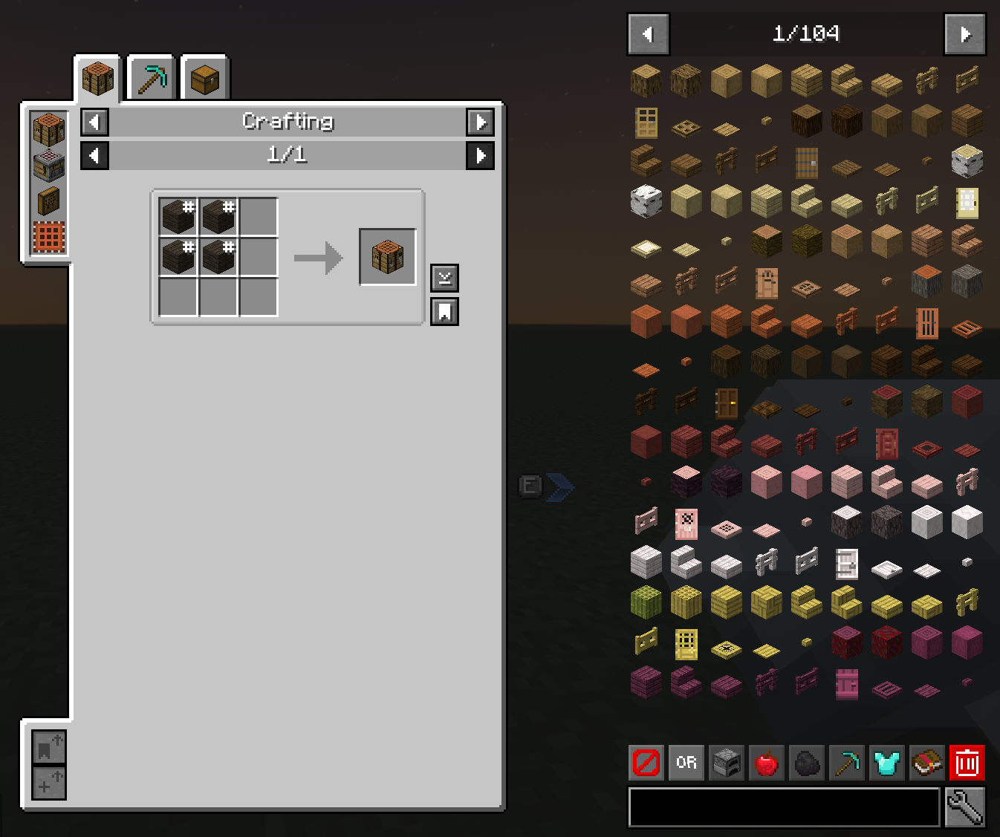

*Recipe and usage views keep the selected process visible beside JEI's filtered item browser.*

JEI search can combine ordinary words with filters. Prefix a term with `@` to search by source mod, prefix an unwanted term with `-` to exclude it, and wrap a phrase in quotation marks when its words must stay together. This is the quickest way to browse one large content mod without listing every item in this handbook.

JEI's companion features answer different questions: **JEI Trades** reads current registered villager trades; **Just Enough Filters** narrows large item lists; **Advanced Loot Info** shows loot tables and trades; **Advanced Worldgen Info** describes where configured features and resources can generate; **Show My Recipes** makes the vanilla recipe book a broader discovery aid. Availability still depends on what the current world and server register.

JEI's cheat, edit, and developer controls are reference entries rather than normal-player tools. They remain unbound in the recommended profile. On a survival server, use JEI for information and recipe transfer only; permissions and server rules remain authoritative.

### HUD changes and customization

#### Recommended HUD arrangement

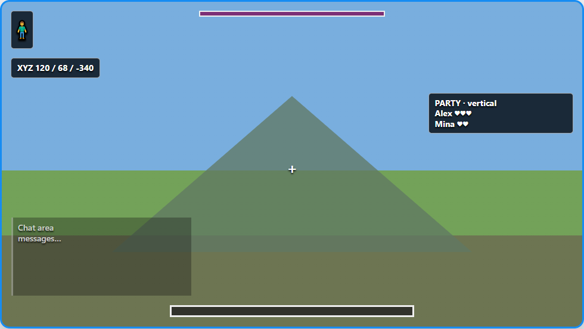

*Layout diagram: stack personal information on the upper-left and reserve the right edge for the party roster.*

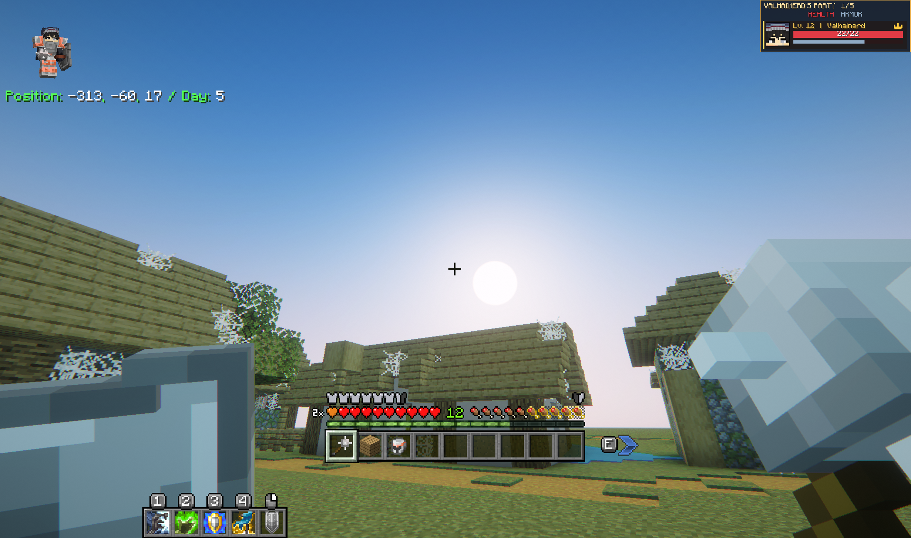

*In-game example: the arrangement preserves the center while keeping character, location, and party information visible.*

This is the pack recommendation, not a locked layout. It gives personal status elements a consistent upper-left stack, leaves the center clear for combat, and gives a multiplayer roster enough vertical space on the right.

1. Open Better Party with `B`, set its roster to a vertical arrangement, and place it on the right.
2. Open Paper Doll's configuration and place the model in the upper-left. Adjust its scale and action-based visibility before positioning the coordinates beneath it.
3. Press `Ctrl + N` to open Coordinates Display, then use `Alt + N` for HUD positioning. Place the coordinate panel directly below Paper Doll.
4. Use `Shift + N` to cycle coordinate display modes and choose the amount of navigation information that remains readable at the current GUI scale.
5. Test the result with status effects visible, the chat open, and a full party. Move the right-side roster if a server scoreboard or effect list competes for the same edge.

Recheck the layout after changing GUI scale or resolution. The image shows the relationship between elements; it is not a pixel-perfect requirement for every display.

#### Coordinates Display configuration

Coordinates Display can show precise position, chunk position, facing direction, biome, and other navigation information. Its display modes offer different densities: a minimal mode keeps the footprint small, a compass-oriented mode emphasizes direction, and a hotbar-oriented mode moves the readout closer to the lower center of the screen. Use the mode that fits the current activity; the upper-left arrangement above is simply the most balanced general setup.

The recommended coordinate group is `N` to toggle the HUD, `Shift + N` to cycle modes, `Alt + N` to reposition it, and `Ctrl + N` to open its GUI. `Y` sends the current position in chat and `H` toggles the 3D compass. Marking, clipboard, and `/tp` actions remain unbound unless a player needs them.

#### Better Party configuration

Better Party's HUD is most useful when it shows the roster without obscuring the player's own status information. Keep it vertical on the right and scale it for the usual party size. If status effects or a server scoreboard also occupy that side, move or reduce the party panel rather than stacking interfaces on top of one another. Party creation, roles, chat, friendly fire, XP sharing, and revival coordination are covered under [Parties and multiplayer cooperation](#parties-and-multiplayer-cooperation).

#### Paper Doll configuration

Paper Doll shows a small player model during configured actions such as sprinting, swimming, crouching, flying, or gliding. Its position, size, display duration, head movement, and visibility rules are configurable. Place it first because its model needs more vertical space than a coordinate line; then position Coordinates Display directly beneath it.

- **Hovering Hotbar** — Raises the hotbar from the screen edge with a configurable offset and optional experience-level placement.
- **Overflowing Bars** — Compresses health, armor, and armor-toughness values beyond vanilla limits into layered bars with readable counters.
- **Paper Doll** — Adds a configurable, action-aware player model to the HUD.

Hovering Hotbar uses `Up Arrow` and `Down Arrow` in the recommended profile for quick positioning. Overflowing Bars becomes important when RPG equipment raises defensive or health values beyond the normal display range; its layers and counters represent additional capacity rather than a second, separate health pool.

### Cosmetic and animation changes

- **SimpleHats Lite** — Adds wearable hats and cosmetic variations. Use the Curios head slot to equip them; grab bags, crafting, dyeing, and variants are cosmetic systems rather than a combat progression path.
- **Distinct Potions** — Gives potion categories clearer names, colors, and bottle appearances so they are easier to distinguish.
- **Quick Skin** — Adds in-game skin, model, and cape management without returning to the launcher.
- **PatPat** — Adds a friendly player-to-player and player-to-creature pat interaction.
- **Kingdom Cats Replacer** — Replaces vanilla cat visuals with seven animated models while preserving vanilla cat behavior.

These features mainly change presentation. Kingdom Cats Replacer does not create a second cat progression system, while Distinct Potions changes recognition rather than potion effects. Quick Skin controls appearance; whether other players see a selected skin or cape depends on the server connection and their compatible setup.

To pat a supported player or creature, hold the configured Sneak key and right-click. With the recommended profile that means hold `C` and use the normal right mouse button; the interaction is contextual and does not replace ordinary use actions on every target.

### Optional client features

- **Coordinates Display** — Shows the player's coordinates and related navigation information on a configurable HUD.
- **Iris** — Enables shader-pack support.
- **Sodium** — Replaces the renderer to improve frame rate and reduce rendering stutter.

These client-only options affect your interface or rendering, not shared server rules.

Sodium enables supported renderer optimizations by default; use advanced settings only for troubleshooting. Iris manages optional shader packs in Video Settings; `Alt + R` reloads them in this profile. If performance or visual artifacts worsen, disable shaders and retest before changing other graphics settings.

#### Sources for interface and client features

- [Jade](https://modrinth.com/mod/jade), [AppleSkin](https://modrinth.com/mod/appleskin), [Effect Insights](https://modrinth.com/mod/effect-insights), [Enchantment Insights](https://modrinth.com/mod/enchantment-insights), [Food Effect Tooltips](https://modrinth.com/mod/foodeffecttooltips), [Floating Damage Indicators](https://modrinth.com/mod/floating-damage-indicators), and [Controlling](https://modrinth.com/mod/controlling)
- [Just Enough Items](https://modrinth.com/mod/jei), [JEI Trades](https://modrinth.com/mod/jei-trades), [Just Enough Filters](https://modrinth.com/mod/just-enough-filters), [Advanced Loot Info](https://modrinth.com/mod/advanced-loot-info), and [Advanced Worldgen Info](https://modrinth.com/mod/advanced-worldgen-info)
- [Coordinates Display](https://modrinth.com/mod/coordinates-display), [Paper Doll](https://modrinth.com/mod/paper-doll), [Hovering Hotbar](https://modrinth.com/mod/hovering-hotbar), and [Overflowing Bars](https://modrinth.com/mod/overflowing-bars)
- [SimpleHats Lite](https://www.curseforge.com/minecraft/mc-mods/simplehats-lite), [Distinct Potions](https://modrinth.com/mod/distinct-potions), [Quick Skin](https://modrinth.com/mod/quick-skin), and [PatPat](https://modrinth.com/plugin/patpat)
- [Charm of Undying: Reborn](https://www.curseforge.com/minecraft/mc-mods/charm-of-undying-reborn) and [Harder Natural Healing](https://www.curseforge.com/minecraft/mc-mods/harder-natural-healing)
- [Iris](https://modrinth.com/mod/iris) and [Sodium](https://modrinth.com/mod/sodium)

### Alphabetical mod index

- [Abyssal Ocean](#integrated-world-and-dimension-expansions)
- [Advanced Loot Info](#recipe-and-loot-information)
- [Advanced Worldgen Info](#recipe-and-loot-information)
- [Air Jump Enchantment](#weapons-armor-jewelry-and-relics)
- [Alchemia](#alchemia)
- [Alex's Caves](#alexs-caves)
- [Alex's Mobs](#creatures-and-hostile-mobs)
- [Animal Garden collection](#creatures-and-hostile-mobs)
- [Animal Garden: Bull Shark](#creatures-and-hostile-mobs)
- [Animal Garden: Capybara](#creatures-and-hostile-mobs)
- [Animal Garden: Fennec Fox](#creatures-and-hostile-mobs)
- [Animal Garden: Harp Seal](#creatures-and-hostile-mobs)
- [Animal Garden: Hippopotamus](#creatures-and-hostile-mobs)
- [Animal Garden: Lion](#creatures-and-hostile-mobs)
- [Animal Garden: Narwhal](#creatures-and-hostile-mobs)
- [Animal Garden: Owl](#creatures-and-hostile-mobs)
- [Animal Garden: Prairie Dog](#creatures-and-hostile-mobs)
- [Animal Garden: Red Panda](#creatures-and-hostile-mobs)
- [Animal Garden: Red River Hog](#creatures-and-hostile-mobs)
- [Animal Garden: Spotted Hyena](#creatures-and-hostile-mobs)
- [Animal Garden: Springhare](#creatures-and-hostile-mobs)
- [Animal Garden: Yellow Mongoose](#creatures-and-hostile-mobs)
- [Animal Pen](#companions-pets-villagers-and-settlements)
- [Antique Trading Ship](#structures-and-dungeons)
- [AppleSkin](#information-overlays-and-tooltips)
- [Arcane Lanterns](#building-and-decoration)
- [Archers](#rpg-classes)
- [Armor Quick Swap](#weapons-armor-jewelry-and-relics)
- [Armor Statues](#building-and-decoration)
- [Armor Trim Item Fix](#enchanting-and-equipment-improvement)
- [Armored Foes](#dangerous-nights-and-environmental-threats)
- [Armory](#weapons-armor-jewelry-and-relics)
- [Arrow+](#weapons-armor-jewelry-and-relics)
- [Arsenal](#weapons-armor-jewelry-and-relics)
- [ATi Structures: Vanilla Edition](#structures-and-dungeons)
- [Attack Speed Enchantment](#weapons-armor-jewelry-and-relics)
- [Awesome Dungeon](#structures-and-dungeons)
- [Awesome Dungeon collection](#structures-and-dungeons)
- [Awesome Dungeon End Edition](#structures-and-dungeons)
- [Awesome Dungeon Ocean Edition](#structures-and-dungeons)
- [Barricades](#building-and-decoration)
- [Better Combat](#combat-controls-and-dodge-rolling)
- [Better Nether](#better-nether)
- [Better Party](#parties-and-multiplayer-cooperation)
- [Better Respawn](#death-revival-graves-and-respawning)
- [Better Revive](#death-revival-graves-and-respawning)
- [Better Rotten Flesh](#farming-food-and-cooking)
- [Bifrost Teleport](#travel-maps-compasses-and-teleportation)
- [Biomes O' Plenty](#integrated-world-and-dimension-expansions)
- [Blood Moon](#dangerous-nights-and-environmental-threats)
- [Bosslike Ender Dragon](#bosses-and-major-encounters)
- [Charm of Undying: Reborn](#death-revival-graves-and-respawning)
- [Clear End City](#integrated-world-and-dimension-expansions)
- [Combat Roll](#combat-controls-and-dodge-rolling)
- [Compact Villagers](#companions-pets-villagers-and-settlements)
- [Companions: Dogfolk](#companions-pets-villagers-and-settlements)
- [Controlling](#information-overlays-and-tooltips)
- [Coordinates Display](#optional-client-features)
- [Craftable Creatures Evolution](#creatures-and-hostile-mobs)
- [DarkSmithing](#enchanting-and-equipment-improvement)
- [Dedicated Elytra Slot](#weapons-armor-jewelry-and-relics)
- [Display Delight](#building-and-decoration)
- [Distinct Potions](#cosmetic-and-animation-changes)
- [DnT Ancient City Overhaul](#structures-and-dungeons)
- [DnT Mineshaft Overhaul](#structures-and-dungeons)
- [DnT Pillager Outpost Overhaul](#structures-and-dungeons)
- [DnT Stronghold Overhaul](#structures-and-dungeons)
- [Double Hit Enchantment](#weapons-armor-jewelry-and-relics)
- [Downfall Enchantment](#weapons-armor-jewelry-and-relics)
- [Dungeons and Taverns](#structures-and-dungeons)
- [Dungeons and Taverns overhauls](#structures-and-dungeons)
- [Dungeons Dimensions: Nether](#integrated-world-and-dimension-expansions)
- [Easy Anvils](#enchanting-and-equipment-improvement)
- [Easy Magic](#enchanting-and-equipment-improvement)
- [Easy Shulker Boxes](#storage-and-inventory-management)
- [Effect Insights](#information-overlays-and-tooltips)
- [Effortless Building](#building-and-decoration)
- [Elytra Trims](#enchanting-and-equipment-improvement)
- [Enchanting Infuser](#enchanting-and-equipment-improvement)
- [Enchantment Insights](#information-overlays-and-tooltips)
- [Enchantments collection](#weapons-armor-jewelry-and-relics)
- [Ender Zoology](#creatures-and-hostile-mobs)
- [Explorer's Compass](#travel-maps-compasses-and-teleportation)
- [Explorify](#structures-and-dungeons)
- [Farmer's Delight](#farmers-delight)
- [Fletching Recipe](#weapons-armor-jewelry-and-relics)
- [Floating Damage Indicators](#information-overlays-and-tooltips)
- [Food Effect Tooltips](#information-overlays-and-tooltips)
- [Functional Sculptures](#building-and-decoration)
- [Gateway of Doom](#bosses-and-major-encounters)
- [Gazebos](#structures-and-dungeons)
- [Goblin Traders](#creatures-and-hostile-mobs)
- [Golden Hopper](#item-transport-and-logistics)
- [Guard Ribbits](#creatures-and-hostile-mobs)
- [Guard Villagers](#creatures-and-hostile-mobs)
- [Harder Natural Healing](#death-revival-graves-and-respawning)
- [Hopo Better Underwater Ruins](#structures-and-dungeons)
- [Hopper Gadgetry](#item-transport-and-logistics)
- [Hovering Hotbar](#hud-changes-and-customization)
- [Ice Enchantments](#weapons-armor-jewelry-and-relics)
- [Illager Invasion](#invasions-and-wave-events)
- [Improved Village Placement](#structures-and-dungeons)
- [Invasion](#invasions-and-wave-events)
- [Iourus Races](#races-and-racial-traits)
- [Iris](#optional-client-features)
- [Iron Wolf Armor](#companions-pets-villagers-and-settlements)
- [It Takes a Pillage](#invasions-and-wave-events)
- [Jade](#information-overlays-and-tooltips)
- [JEI Trades](#recipe-and-loot-information)
- [Jewelry](#weapons-armor-jewelry-and-relics)
- [Just Enough Filters](#recipe-and-loot-information)
- [Just Enough Items](#recipe-and-loot-information)
- [Kaleidoscope Cookery](#farming-food-and-cooking)
- [Kingdom Cats Replacer](#cosmetic-and-animation-changes)
- [Life Steal Enchantment](#weapons-armor-jewelry-and-relics)
- [Linked Chests](#storage-and-inventory-management)
- [Lullaby's Mobs](#creatures-and-hostile-mobs)
- [Ly-Fangs Enchantment](#weapons-armor-jewelry-and-relics)
- [Macaw's Bridges](#macaws-building-collection)
- [Macaw's building collection](#macaws-building-collection)
- [Macaw's Doors](#macaws-building-collection)
- [Macaw's Fences and Walls](#macaws-building-collection)
- [Macaw's Furniture](#macaws-building-collection)
- [Macaw's Holidays](#macaws-building-collection)
- [Macaw's Lights and Lamps](#macaws-building-collection)
- [Macaw's Paintings](#macaws-building-collection)
- [Macaw's Paths and Pavings](#macaws-building-collection)
- [Macaw's Roofs](#macaws-building-collection)
- [Macaw's Stairs](#macaws-building-collection)
- [Macaw's Trapdoors](#macaws-building-collection)
- [Macaw's Windows](#macaws-building-collection)
- [Market Board](#trading-and-multiplayer-economy)
- [Moblets](#creatures-and-hostile-mobs)
- [Moog's Bountiful Structures](#structures-and-dungeons)
- [Moog's End Structures](#structures-and-dungeons)
- [Moog's Nether Structures](#structures-and-dungeons)
- [Moog's Ocean Structures](#structures-and-dungeons)
- [Moog's structure collection](#structures-and-dungeons)
- [Moog's Temples Reimagined](#structures-and-dungeons)
- [Moog's Voyager Structures](#structures-and-dungeons)
- [Moonstone](#weapons-armor-jewelry-and-relics)
- [Mounts and Monsters](#creatures-and-hostile-mobs)
- [Much More Dungeons](#structures-and-dungeons)
- [Mutants and Zombies](#creatures-and-hostile-mobs)
- [Name Tag Upgrade](#companions-pets-villagers-and-settlements)
- [Naturally Trimmed](#enchanting-and-equipment-improvement)
- [Nature's Compass](#travel-maps-compasses-and-teleportation)
- [No Crop Destruction](#farming-food-and-cooking)
- [Nullscape](#integrated-world-and-dimension-expansions)
- [Ocean Lily Pad Village](#structures-and-dungeons)
- [OneKeyMiner](#resource-gathering-and-repetitive-actions)
- [Overflowing Bars](#hud-changes-and-customization)
- [Paladins & Priests](#rpg-classes)
- [Paper Doll](#hud-changes-and-customization)
- [Party Creepers](#creatures-and-hostile-mobs)
- [PatPat](#cosmetic-and-animation-changes)
- [Pet Status](#companions-pets-villagers-and-settlements)
- [Pet Vault](#companions-pets-villagers-and-settlements)
- [PlayerRevive](#death-revival-graves-and-respawning)
- [Potion Time Stacker](#potions-and-alchemy)
- [Potions Stack](#potions-and-alchemy)
- [Pro Placer](#building-and-decoration)
- [Pufferfish's Skills](#skill-trees-and-character-progression)
- [Puffsprout](#companions-pets-villagers-and-settlements)
- [Quick Skin](#cosmetic-and-animation-changes)
- [Relics](#weapons-armor-jewelry-and-relics)
- [Ribbits](#creatures-and-hostile-mobs)
- [Rogues & Warriors](#rpg-classes)
- [RPG classes](#rpg-classes)
- [Runes](#abilities-spells-runes-and-resources)
- [Seaworthy Boats](#vehicles-and-travel-equipment)
- [Serene Seasons](#integrated-world-and-dimension-expansions)
- [Shield Upgrades](#weapons-armor-jewelry-and-relics)
- [Show My Recipes](#recipe-and-loot-information)
- [SimpleHats Lite](#cosmetic-and-animation-changes)
- [Shroomcraft](#shroomcraft)
- [Spiky Enchantment](#weapons-armor-jewelry-and-relics)
- [Skill Perks](#skill-trees-and-character-progression)
- [Skill Tree (RPG Series)](#skill-trees-and-character-progression)
- [Sodium](#optional-client-features)
- [Somnora](#dangerous-nights-and-environmental-threats)
- [Sophisticated Backpacks](#storage-and-inventory-management)
- [Sophisticated Inventory Interactions](#item-transport-and-logistics)
- [Sophisticated Item Actions](#item-transport-and-logistics)
- [Spell Engine](#abilities-spells-runes-and-resources)
- [Starcatcher](#starcatcher)
- [Stellarity](#stellarity)
- [Stonecutting Upgrade](#building-and-decoration)
- [Stoneworks](#building-and-decoration)
- [Target Dummy](#combat-controls-and-dodge-rolling)
- [Terralith](#integrated-world-and-dimension-expansions)
- [The Darkness Will Find You](#dangerous-nights-and-environmental-threats)
- [The Graveyard](#the-graveyard)
- [Thunder Strike Enchantment](#weapons-armor-jewelry-and-relics)
- [Tom's Simple Storage](#storage-and-inventory-management)
- [Too Many Bows](#weapons-armor-jewelry-and-relics)
- [Tool Belt](#weapons-armor-jewelry-and-relics)
- [Towers of Chambers](#structures-and-dungeons)
- [Towns and Towers](#structures-and-dungeons)
- [True Shot Enchantment](#weapons-armor-jewelry-and-relics)
- [Ultimate Warden](#bosses-and-major-encounters)
- [Underground Villages](#structures-and-dungeons)
- [Universal Bone Meal](#farming-food-and-cooking)
- [Universal Enchants](#enchanting-and-equipment-improvement)
- [Vehicle Upgrade](#vehicles-and-travel-equipment)
- [Vital Relics](#weapons-armor-jewelry-and-relics)
- [Waystones](#travel-maps-compasses-and-teleportation)
- [Wild Pets](#companions-pets-villagers-and-settlements)
- [William Wythers' Overhauled Overworld](#integrated-world-and-dimension-expansions)
- [Withered Lands](#withered-lands)
- [Wizards](#rpg-classes)
- [World Bosses](#bosses-and-major-encounters)
- [Xaero's Map Multiplayer](#travel-maps-compasses-and-teleportation)
- [Xaero's World Map](#travel-maps-compasses-and-teleportation)

### Gameplay-tag index

#### Combat

- [Vital Relics](#weapons-armor-jewelry-and-relics)
- [Better Combat](#combat-controls-and-dodge-rolling)
- [Combat Roll](#combat-controls-and-dodge-rolling)
- [Target Dummy](#combat-controls-and-dodge-rolling)
- [RPG classes](#rpg-classes)
- [World Bosses](#bosses-and-major-encounters)
- [Invasion](#invasions-and-wave-events)

#### Character

- [Iourus Races](#races-and-racial-traits)
- [RPG classes](#rpg-classes)
- [Skill Tree (RPG Series)](#skill-trees-and-character-progression)
- [Pufferfish's Skills](#skill-trees-and-character-progression)
- [Skill Perks](#skill-trees-and-character-progression)

#### Skills

- [Skill Tree (RPG Series)](#skill-trees-and-character-progression)
- [Pufferfish's Skills](#skill-trees-and-character-progression)
- [Skill Perks](#skill-trees-and-character-progression)

#### Magic

- [Vital Relics](#weapons-armor-jewelry-and-relics)
- [RPG classes](#rpg-classes)
- [Spell Engine](#abilities-spells-runes-and-resources)
- [Runes](#abilities-spells-runes-and-resources)
- [Alchemia](#alchemia)
- [Arcane Lanterns](#building-and-decoration)

#### Equipment

- [Arsenal](#weapons-armor-jewelry-and-relics)
- [Armory](#weapons-armor-jewelry-and-relics)
- [Charm of Undying: Reborn](#death-revival-graves-and-respawning)
- [Dedicated Elytra Slot](#weapons-armor-jewelry-and-relics)
- [Jewelry](#weapons-armor-jewelry-and-relics)
- [Relics](#weapons-armor-jewelry-and-relics)
- [Vital Relics](#weapons-armor-jewelry-and-relics)
- [Moonstone](#weapons-armor-jewelry-and-relics)
- [Tool Belt](#weapons-armor-jewelry-and-relics)
- [Alex's Caves](#alexs-caves)
- [Stellarity](#stellarity)

#### Bosses

- [World Bosses](#bosses-and-major-encounters)
- [Bosslike Ender Dragon](#bosses-and-major-encounters)
- [Ultimate Warden](#bosses-and-major-encounters)
- [Gateway of Doom](#bosses-and-major-encounters)

#### Events

- [Invasion](#invasions-and-wave-events)
- [Blood Moon](#dangerous-nights-and-environmental-threats)
- [Illager Invasion](#invasions-and-wave-events)
- [It Takes a Pillage](#invasions-and-wave-events)
- [Starcatcher](#starcatcher)

#### World Generation

- [Alex's Caves](#alexs-caves)
- [Biomes O' Plenty](#integrated-world-and-dimension-expansions)
- [Terralith](#integrated-world-and-dimension-expansions)
- [Better Nether](#better-nether)
- [Nullscape](#integrated-world-and-dimension-expansions)
- [Stellarity](#stellarity)

#### Structures

- [Dungeons and Taverns](#structures-and-dungeons)
- [Moog's structure collection](#structures-and-dungeons)
- [Towns and Towers](#structures-and-dungeons)
- [The Graveyard](#the-graveyard)

#### Creatures

- [Alex's Mobs](#creatures-and-hostile-mobs)
- [Animal Garden collection](#creatures-and-hostile-mobs)
- [Party Creepers](#creatures-and-hostile-mobs)
- [Shroomcraft](#shroomcraft)
- [Ender Zoology](#creatures-and-hostile-mobs)
- [Moonstone](#weapons-armor-jewelry-and-relics)

#### Companions

- [Companions: Dogfolk](#companions-pets-villagers-and-settlements)
- [Wild Pets](#companions-pets-villagers-and-settlements)
- [Puffsprout](#companions-pets-villagers-and-settlements)
- [Pet Vault](#companions-pets-villagers-and-settlements)
- [Pet Status](#companions-pets-villagers-and-settlements)

#### Farming

- [Farmer's Delight](#farmers-delight)
- [Kaleidoscope Cookery](#farming-food-and-cooking)
- [OneKeyMiner](#resource-gathering-and-repetitive-actions)
- [Shroomcraft](#shroomcraft)
- [Universal Bone Meal](#farming-food-and-cooking)

#### Food

- [Farmer's Delight](#farmers-delight)
- [Kaleidoscope Cookery](#farming-food-and-cooking)
- [Starcatcher](#starcatcher)
- [Better Rotten Flesh](#farming-food-and-cooking)
- [Harder Natural Healing](#death-revival-graves-and-respawning)

#### Building

- [Macaw's building collection](#macaws-building-collection)
- [Effortless Building](#building-and-decoration)
- [Stoneworks](#building-and-decoration)
- [Pro Placer](#building-and-decoration)

#### Storage

- [Sophisticated Backpacks](#storage-and-inventory-management)
- [Tom's Simple Storage](#storage-and-inventory-management)
- [Linked Chests](#storage-and-inventory-management)

#### Travel

- [Waystones](#travel-maps-compasses-and-teleportation)
- [Bifrost Teleport](#travel-maps-compasses-and-teleportation)
- [Xaero's World Map](#travel-maps-compasses-and-teleportation)
- [Seaworthy Boats](#vehicles-and-travel-equipment)
- [Vehicle Upgrade](#vehicles-and-travel-equipment)
- [Dedicated Elytra Slot](#weapons-armor-jewelry-and-relics)

#### Multiplayer

- [Better Party](#parties-and-multiplayer-cooperation)
- [Market Board](#trading-and-multiplayer-economy)
- [PlayerRevive](#death-revival-graves-and-respawning)
- [Better Revive](#death-revival-graves-and-respawning)

#### Controls

- [Better Combat](#combat-controls-and-dodge-rolling)
- [Combat Roll](#combat-controls-and-dodge-rolling)
- [Spell Engine](#abilities-spells-runes-and-resources)
- [OneKeyMiner](#resource-gathering-and-repetitive-actions)
- [Effortless Building](#building-and-decoration)
- [Tool Belt](#weapons-armor-jewelry-and-relics)

#### HUD

- [Paper Doll](#hud-changes-and-customization)
- [Coordinates Display](#optional-client-features)
- [Better Party](#parties-and-multiplayer-cooperation)
- [Hovering Hotbar](#hud-changes-and-customization)
- [Overflowing Bars](#hud-changes-and-customization)
